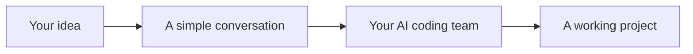
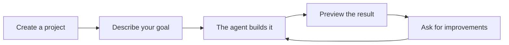
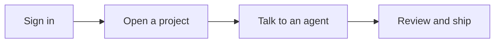
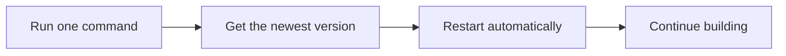

# remote.futrx

### Your AI coding team. One workspace. Anywhere.

remote.futrx brings **Claude Code, Codex, and Kimi Code** together in one clean, browser-based workspace.

Start with an idea. Talk to the agent you prefer. Watch it create and improve real project files. Open the result in a full code editor, terminal, or live browser preview—without leaving the conversation.



## One place to turn ideas into software

- **Choose your agent** — work with Claude, Codex, or Kimi at any time.
- **See real progress** — agents work directly on your project, not in a throwaway chat.
- **Preview instantly** — open websites and apps as they are being built.
- **Stay in control** — inspect files, use the terminal, and review Git history whenever you want.
- **Keep projects separate** — every project gets its own protected workspace.
- **Work from anywhere** — all you need is a web browser.
- **Own your workspace** — remote.futrx runs on your server, under your control.

## More than an AI chat

remote.futrx gives every project the tools needed to go from a conversation to a finished result.

| What you get | What it means for you |
| --- | --- |
| AI chat | Describe what you want in everyday language |
| Multiple agents | Pick the best AI for each task |
| Browser IDE | View and edit the code yourself |
| Live preview | See your app while it is being built |
| Project terminal | Run commands without leaving the browser |
| Files and Git history | Review the work and stay informed |
| Separate workspaces | Keep every project organized and isolated |

## How it works

1. Create a project.
2. Choose Claude, Codex, or Kimi.
3. Describe what you want to build or change.
4. Review the result in chat, the IDE, or the live preview.
5. Ask for another change and keep improving it.



## Made for modern builders

remote.futrx is for founders, developers, designers, and small teams who want to build with AI without juggling several terminals, tools, and disconnected chat windows.

Whether you are starting a new product, fixing a bug, exploring an idea, or maintaining an existing codebase, remote.futrx keeps the conversation and the work together.

## Start using remote.futrx

Once your server is ready:

1. Open your remote.futrx website.
2. Sign in.
3. Connect your preferred agents under **Settings → Agents**.
4. Select **New project**.
5. Start building.

Your everyday workflow stays simple:



## Install remote.futrx

This section is for the person setting up the server. Everyone else can simply open the website and start using it.

<details>
<summary><strong>Show the installation steps</strong></summary>

### Before you begin

You need:

- An Ubuntu or Debian server
- A domain name, such as `remote.example.com`
- SSH access using a key
- Ports 80 and 443 open

Point these names to your server's IP address:

- `remote.example.com`
- `code.remote.example.com`
- `*.code.remote.example.com`
- `*.dev.remote.example.com`

### Run the installer

Replace `remote.example.com` with your own domain:

```bash
curl -fsSL https://raw.githubusercontent.com/futrx-com/remote.futrx.com/main/infra/install.sh \
  | sudo bash -s -- remote.example.com
```

The installer prepares the server, builds remote.futrx, and turns on HTTPS for you.

When it finishes, open:

```text
https://remote.example.com
```

> The installer makes SSH key-only for better security. Confirm that your SSH key works before running it.

</details>

<details>
<summary><strong>Recommended: protect the site with Google sign-in</strong></summary>

Create a Google OAuth web application with this redirect URL:

```text
https://remote.example.com/auth/google/callback
```

Then run:

```bash
sudo bash /opt/remote.futrx/infra/install.sh remote.example.com \
  --google-client-id='YOUR_GOOGLE_CLIENT_ID' \
  --google-client-secret='YOUR_GOOGLE_CLIENT_SECRET'
```

The first person to sign in becomes the administrator and can invite other users.

Without Google sign-in, anyone who can reach the website can use it.

</details>

## Update remote.futrx

Updating takes one command:

```bash
sudo bash /opt/remote.futrx/infra/update.sh
```

remote.futrx downloads the newest version, updates its tools, restarts the app, and refreshes idle project workspaces. Active work is skipped safely, and project files are kept.



## The short version

**Bring the best coding agents together. Give each project a real workspace. Build, preview, and improve—all from one browser tab.**
