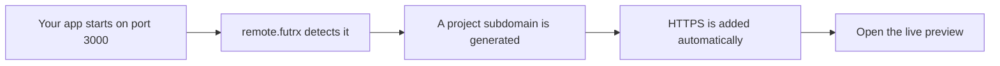
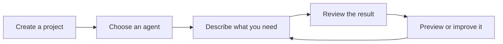
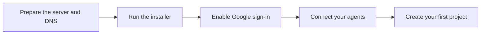

# remote.futrx

remote.futrx is a self-hosted workspace for **Claude Code, Codex, and Kimi Code**.

Create a project, tell an agent what you need, and review its work from your browser. Chat, files, Git history, a terminal, a code editor, and live app previews are all included. Each project runs in a separate workspace.

## Features

### AI workspace

- **Claude, Codex, and Kimi together** — switch agents without switching tools.
- **Model and reasoning controls** — choose the model, effort, and working mode for each chat.
- **Purpose-built modes** — Chat, Plan, Code, Review, Debug, and Full Auto.
- **Reusable skills** — give agents extra workflows and project-specific instructions.
- **Persistent conversations** — resume, fork, rewind, queue prompts, and keep separate chats per project.
- **File attachments** — drag, drop, paste, and resumably upload large files into a conversation.
- **Live progress** — see messages, reasoning, tool calls, and usage while the agent works.

### Project workspaces

- **A separate container for every project** — tools and processes stay isolated from other projects.
- **Persistent project files** — your work survives container restarts, rebuilds, and app updates.
- **Automatic agent setup** — agent tools and sign-in credentials are prepared inside each workspace.
- **Browser-based IDE** — open the complete project in a full code editor.
- **Built-in terminal** — run commands directly inside the project workspace.
- **File manager** — search, preview, download, or export project uploads and generated media.
- **Git history** — inspect commits and diffs, create a safety checkpoint, or return to an earlier commit.
- **Project controls** — start, stop, restart, delete, inspect, and repair a workspace from the UI.
- **Resource limits and monitoring** — manage memory limits and view CPU, memory, disk, process, and network information.

### Automatic previews and domains

- **Automatic port discovery** — remote.futrx finds web apps running inside a project.
- **Auto-generated subdomains** — an app on port `3000` becomes `project--3000.dev.remote.example.com`.
- **Automatic HTTPS certificates** — Caddy creates and renews SSL certificates for the app, IDEs, and preview URLs.
- **No proxy setup per app** — start a server in the workspace and open its generated URL.
- **Built-in live preview** — view the running app beside the agent conversation.
- **Element inspection** — select part of a preview and send its details back to the agent as context.
- **Agent browser** — sign in to a website and let the agent work through a live browser session.
- **On-demand project IDEs** — every project gets its own secure code-editor URL.



### Access and security

- **Self-hosted** — the application and project workspaces run on your server.
- **Google sign-in** — protect the site and manage registered users.
- **Per-project sharing** — choose which users can access each workspace.
- **Admin and member roles** — keep server management separate from project work.
- **Managed project secrets** — pass API keys and environment values to agents without adding them to project files.
- **Isolated previews** — project apps cannot read the main remote.futrx login cookies.
- **Key-only server access** — the installer disables SSH password login.

### Operations

- **One-command installation** — install the app, dependencies, services, workspace image, and HTTPS together.
- **One-command updates** — update the app, agent tools, and project image together.
- **Safe workspace upgrades** — active projects are skipped and persistent files are preserved.
- **Automatic startup** — the app, proxy, and project containers return after a server reboot.
- **Health checks and recovery** — installation verifies the service, while automatic network healing repairs containers that lose connectivity.



## How to use it

1. Open your remote.futrx website and sign in.
2. Go to **Settings → Agents** and connect Claude, ChatGPT, or Kimi.
3. Select **New project** and enter a name.
4. Create a chat and choose an agent.
5. Describe what you want in normal language.
6. Review the result in chat, the IDE, the terminal, or the browser preview.

## Installation

### Requirements

You need:

- A fresh Ubuntu or Debian server
- Root or `sudo` access
- A domain name, such as `remote.example.com`
- A working SSH key
- Ports 80 and 443 open

> The installer disables SSH password login. Confirm that your SSH key works before running it.

### 1. Set up DNS

Point these names to your server's public IP address:

| DNS name | Used for |
| --- | --- |
| `remote.example.com` | Main app |
| `code.remote.example.com` | Code editor |
| `*.code.remote.example.com` | Project code editors |
| `*.dev.remote.example.com` | Project app previews |

Replace `remote.example.com` with your real domain in every step below.

### 2. Run the installer

Connect to your server, then run:

```bash
curl -fsSL https://raw.githubusercontent.com/futrx-com/remote.futrx.com/main/infra/install.sh \
  | sudo bash -s -- remote.example.com
```

The installer downloads the app, installs its requirements, builds it, starts the services, and enables HTTPS. The app is installed in `/opt/remote.futrx`.

### 3. Enable Google sign-in

Google sign-in is strongly recommended. Without it, anyone who can reach the website can use the app.

Create a Google OAuth web application with this authorized redirect URL:

```text
https://remote.example.com/auth/google/callback
```

Run the installer again with your Google credentials:

```bash
sudo bash /opt/remote.futrx/infra/install.sh remote.example.com \
  --google-client-id='YOUR_GOOGLE_CLIENT_ID' \
  --google-client-secret='YOUR_GOOGLE_CLIENT_SECRET'
```

The first Google account to sign in becomes the administrator and can invite other users.

### 4. Open remote.futrx

Visit:

```text
https://remote.example.com
```

Then open **Settings → Agents** and connect the coding agents you want to use.



## Updating

Run this command on the server:

```bash
sudo bash /opt/remote.futrx/infra/update.sh
```

The updater downloads the newest version, rebuilds the app, restarts it, and refreshes idle project workspaces. Active projects are skipped, and project files are preserved.

Run the same command again later to refresh any projects that were busy during the update.
