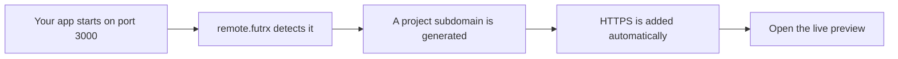
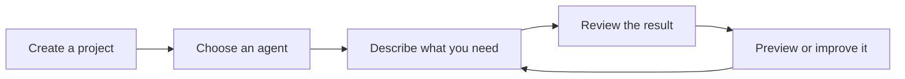
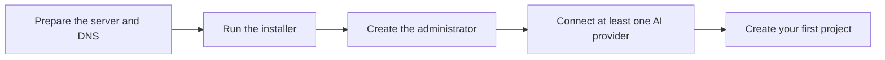

# remote.futrx

remote.futrx is a self-hosted workspace for **Claude Code, Codex, and Kimi Code**.

Create a project, tell an agent what you need, and review its work from your browser. Chat, files, Git history, a terminal, a code editor, and live app previews are all included. Each project runs in a separate workspace.

## Features

### AI workspace

- **Claude, Codex, and Kimi together** — switch agents without switching tools.
- **Model and reasoning controls** — choose the model, effort, and working mode for each chat.
- **Purpose-built modes** — Chat, Plan, Code, Review, Debug, and Full Auto.
- **Reusable skills** — give agents extra workflows and project-specific instructions.
- **Persistent conversations** — resume, fork, rewind, queue prompts, and keep separate chats per project.
- **File attachments** — drag, drop, paste, and resumably upload large files into a conversation.
- **Live progress** — see messages, reasoning, tool calls, and usage while the agent works.
- **Light local control surface** — a July 2026 Activity Monitor capture showed the Remote app at 58.9 MB, or 140.8 MB including every visible matched macOS helper, because the agent workspace runs on the server. See the [method and comparison](docs/01-overview/00-philosophy.md#the-local-resource-dividend).

### Project workspaces

- **A separate container for every project** — tools and processes receive a project-specific namespace and durable mounts.
- **Persistent project files** — your work survives container restarts, rebuilds, and app updates.
- **Automatic agent setup** — agent tools and sign-in credentials are prepared inside each workspace.
- **Browser-based IDE** — open the complete project in a full code editor.
- **Built-in terminal** — run commands directly inside the project workspace.
- **File manager** — browse, search, download, or export project files. Validated file links in chat can preview supported media inline.
- **Git history** — inspect commits and diffs or return a clean repository to an earlier commit. The backend safety-checkpoint path exists, but its dirty-tree form is not rendered in the current UI; commit or stash through Terminal first.
- **Project controls** — start, stop, restart, delete, inspect, and repair a workspace from the UI.
- **Resource limits and monitoring** — manage memory limits and view CPU, memory, disk, process, and network information.

### Automatic previews and domains

- **Automatic port discovery** — remote.futrx finds web apps running inside a project.
- **Auto-generated subdomains** — an app on port `3000` becomes `project--3000.dev.remote.example.com`.
- **Automatic HTTPS certificates** — Caddy creates and renews SSL certificates for the app, IDEs, and preview URLs.
- **No proxy setup per app** — start a server in the workspace and open its generated URL.
- **Built-in live preview** — view the running app beside the agent conversation.
- **Element inspection** — select part of a preview and send its details back to the agent as context.
- **Agent browser** — sign in to a website and let the agent work through a live browser session.
- **On-demand project IDEs** — every project gets its own authenticated code-editor URL. The current proxy checks registered-user access, not project membership, so invited users are not mutually isolated at the IDE boundary.



### Access and security

- **Self-hosted** — the application and project workspaces run on your server.
- **Separate admin and user sign-in** — the administrator uses a local password; invited users use Google.
- **Per-project sharing** — choose which users can access each workspace.
- **Admin and member roles** — keep server management separate from project work.
- **Managed project secrets** — store API keys and environment values centrally, pass them to agent runs, persist single-line values for new container processes, and generate a managed workspace `.env` file.
- **Cookie-isolated previews** — project apps cannot read the main remote.futrx login cookies.
- **Key-only server access** — the installer disables SSH password login.

### Operations

- **One-command installation** — install the app, dependencies, services, workspace image, and HTTPS together.
- **One-command updates** — update the app, agent tools, and project image together.
- **Workspace-preserving upgrades** — project files and provider homes persist when replaceable containers are rebuilt.
- **Automatic startup** — the app, proxy, and project containers return after a server reboot.
- **Health checks and recovery** — installation verifies the service, while automatic network healing repairs containers that lose connectivity.



## How to use it

1. Open your remote.futrx website and sign in.
2. Go to **Settings → Agents** and connect Claude, ChatGPT, or Kimi.
3. Select **New project** and enter a name.
4. Create a chat and choose an agent.
5. Describe what you want in normal language.
6. Review the result in chat, the IDE, the terminal, or the browser preview.

## Installation

### Requirements

You need:

- A fresh Ubuntu or Debian server
- Root or `sudo` access
- A domain name, such as `remote.example.com`
- A working SSH key
- Ports 80 and 443 open

> The installer disables SSH password login. Confirm that your SSH key works before running it.

### 1. Set up DNS

Point these names to your server's public IP address:

| DNS name | Used for |
| --- | --- |
| `remote.example.com` | Main app |
| `code.remote.example.com` | Code editor |
| `*.code.remote.example.com` | Project code editors |
| `*.dev.remote.example.com` | Project app previews |

Replace `remote.example.com` with your real domain in every step below.

### 2. Run the installer

Connect to your server, then run:

```bash
curl -fsSL https://raw.githubusercontent.com/futrx-com/remote.futrx.com/main/infra/install.sh \
  | sudo bash -s -- remote.example.com
```

The installer downloads the app, installs its requirements, builds it, starts the services, and enables HTTPS. The app is installed in `/opt/remote.futrx`.

### 3. Create the administrator

Visit:

```text
https://remote.example.com
```

Create the administrator with your email and a password of at least 12 characters. The password is stored only as a secure one-way hash.

Then connect at least one provider: Claude, Codex, or Kimi. You can add the others later from **Settings → Agents**.

To invite users, open **Settings → Users** and add your Google OAuth client ID and secret first. Google sign-in is used only for invited users, not for the administrator.



## Updating

Run this command on the server:

```bash
sudo bash /opt/remote.futrx/infra/update.sh
```

The updater downloads the newest version, rebuilds the app and base image, then asks the Go workspace lifecycle to migrate agent state and replace project containers. Project files and Codex, Claude, and Kimi homes are persistent.

The updater intends to skip active agent runs, but the current busy-process detector does not match every provider command shape. Until that is fixed, coordinate a maintenance window or run the updater with `--skip-workspaces` while agents are active. See [Deployment and operations](docs/04-operations/09-deployment-and-operations.md#update-flow).

## Documentation

- [Philosophy](docs/01-overview/00-philosophy.md) — the project-computer doctrine, capability/control split, isolation contract, and hardening roadmap
- [Architecture](ARCHITECTURE.md) — components, data flow, and trust boundaries, with deep dives under [docs/](docs/)
- [Threat model](docs/threat-model.md) — what the security design defends against, and what it does not
- [Known limitations](docs/known-limitations.md) — current constraints to be aware of before deploying
- [Contributing](CONTRIBUTING.md) — development setup and contribution process
- [Security policy](SECURITY.md) — how to report vulnerabilities

## License

Copyright (c) 2026 Futrx.

remote.futrx is free software, licensed under the [GNU Affero General Public License v3.0](LICENSE) (see also [NOTICE](NOTICE)). You may self-host, modify, and redistribute it under the AGPL's terms; if you offer a modified version as a network service, the AGPL requires you to make your modified source available to its users.
