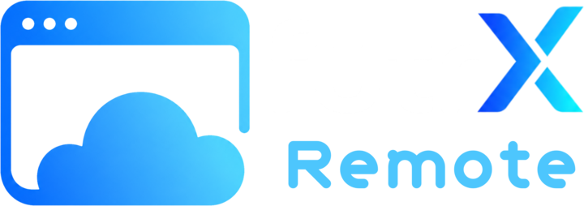
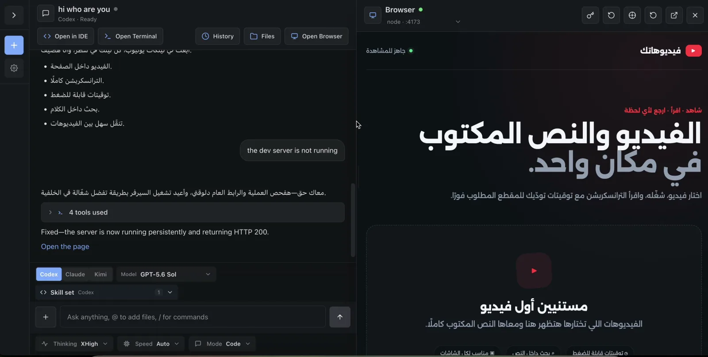
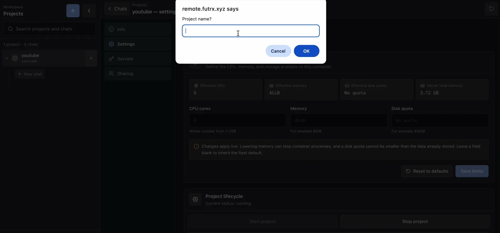
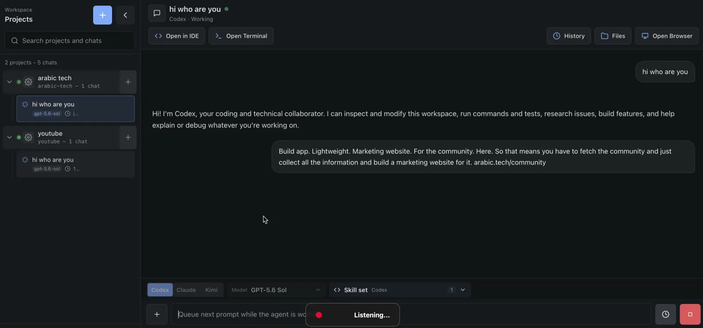
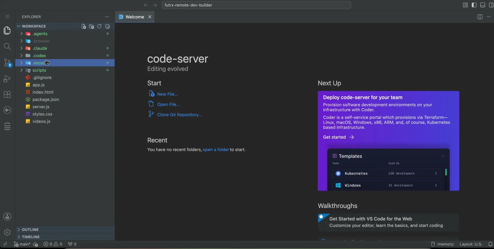
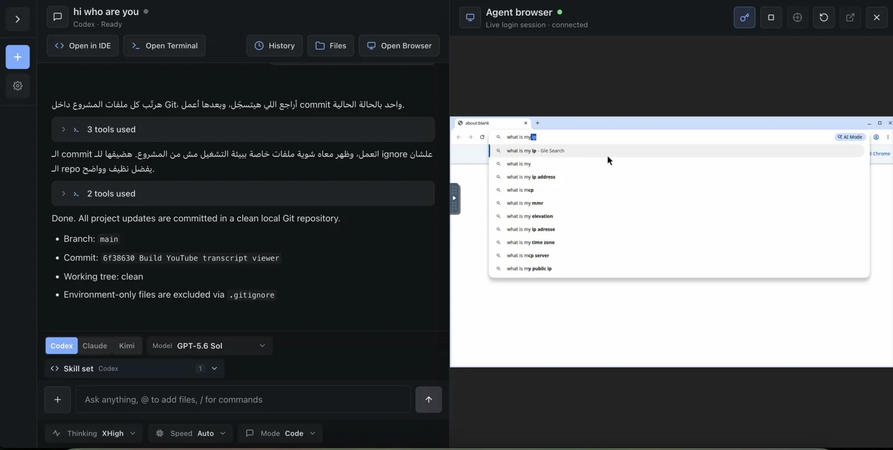
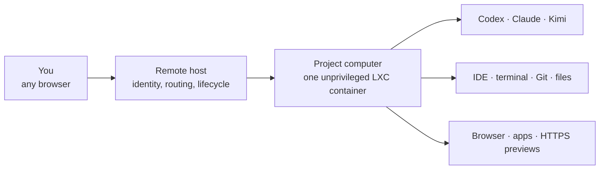

<p align="center">
  <a href="https://remote.futrx.com/">
    
  </a>
</p>

<h1 align="center">Give every AI project its own computer.</h1>

<p align="center">
  Run Codex, Claude Code, and Kimi in separate, always-on Linux workspaces on your own server.
  Use everything from one browser: chat, IDE, terminal, files, Git, live previews, and a shared browser.
</p>

<p align="center">
  <a href="https://remote.futrx.com/"><strong>Website</strong></a>
  ·
  <a href="https://docs.remote.futrx.com/"><strong>Documentation</strong></a>
  ·
  <a href="#quick-start"><strong>Install</strong></a>
  ·
  <a href="https://github.com/futrx-com/remote.futrx.com/issues"><strong>Roadmap</strong></a>
</p>



## What is Remote?

Remote is an open-source, self-hosted home for AI coding agents.

Think of every project as its own server-side computer:

- It has a durable workspace, processes, ports, settings, and agent sessions.
- Codex, Claude Code, and Kimi can work in the same project without moving files between tools.
- The work keeps running on your server when you close your laptop.
- You can watch, review, edit, restart, or take over from any browser.

Remote is not another AI model. It gives the models you already use a complete place to work.

## A quick tour

<table>
  <tr>
    <td width="50%">
      
      <br>
      <strong>1. Create a project</strong><br>
      Remote prepares a separate Linux workspace with its own files, processes, ports, and agent homes.
    </td>
    <td width="50%">
      
      <br>
      <strong>2. Run agents in parallel</strong><br>
      Keep several chats moving while every agent works against the same project state.
    </td>
  </tr>
  <tr>
    <td width="50%">
      
      <br>
      <strong>3. Inspect the real workspace</strong><br>
      Open the project in the browser IDE, terminal, file manager, or Git history.
    </td>
    <td width="50%">
      
      <br>
      <strong>4. Share the browser</strong><br>
      Watch the agent use a headed browser, then take control for sign-in or human judgment.
    </td>
  </tr>
</table>

See the continuous five-step product tour at [remote.futrx.com](https://remote.futrx.com/#product-tour).

## What you get

- **One project computer per project** — an unprivileged LXC container with durable files and agent homes.
- **Your choice of agent** — use Codex, Claude Code, or Kimi with model, reasoning, and mode controls.
- **A complete development surface** — chat, browser IDE, root terminal, files, uploads, Git history, and reusable skills.
- **Live applications** — Remote finds listening ports, creates project URLs, adds HTTPS, and shows the app beside the conversation.
- **A browser agents and humans can share** — let an agent browse visually, watch it work, or take over the same session.
- **Controls outside the workspace** — manage access, secrets, CPU, memory, lifecycle, and recovery from the Remote host.

## How it works



The project computer is the capability boundary: agents can install tools, run servers, use Git, and browse inside it. The Remote host keeps authentication, routing, membership, and container lifecycle controls outside that boundary.

## Quick start

### What you need

- A fresh Ubuntu or Debian server
- Root or `sudo` access
- A domain name
- A working SSH key
- Ports 80 and 443 open

> [!IMPORTANT]
> The installer disables SSH password login. Confirm that key-based SSH access works before you run it.

### 1. Point DNS to the server

For a base domain such as `remote.example.com`, create these records:

| DNS name | Purpose |
| --- | --- |
| `remote.example.com` | Remote web app |
| `code.remote.example.com` | Browser IDE |
| `*.code.remote.example.com` | Per-project browser IDEs |
| `*.dev.remote.example.com` | Per-project application previews |

### 2. Install Remote

Connect to the server and run:

```bash
curl -fsSL https://raw.githubusercontent.com/futrx-com/remote.futrx.com/main/infra/install.sh \
  | sudo bash -s -- remote.example.com
```

Replace `remote.example.com` with your real domain. The installer downloads Remote, installs its dependencies, builds the workspace image, starts the services, and enables HTTPS.

### 3. Create your first project

1. Visit `https://remote.example.com`.
2. Create the administrator account.
3. Open **Settings → Agents** and connect Codex, Claude Code, or Kimi.
4. Select **New project**.
5. Start a chat and describe what you want in normal language.

Remote will show the agent's progress. When the work is ready, review it in the chat, IDE, terminal, file manager, Git history, or live preview.

## Security in plain language

Remote is designed to reduce the blast radius of agent work, not to promise an air gap:

- Projects use separate unprivileged LXC containers, but they share the host kernel.
- The host administrator can access project data and controls.
- Secrets given to a project are readable by agents working in that project.
- Durable storage survives routine container replacement, but it is not a backup.

Before using Remote with valuable code or credentials, read the [threat model](docs/threat-model.md), [known limitations](docs/known-limitations.md), and [security policy](SECURITY.md).

## Updating

Run on the Remote server:

```bash
sudo bash /opt/remote.futrx/infra/update.sh
```

The updater rebuilds the app and project image while preserving project files and provider homes. Coordinate a maintenance window, or use `--skip-workspaces`, when agents are actively running. See [Deployment and operations](docs/04-operations/09-deployment-and-operations.md#update-flow) for details.

## Learn more

- [Documentation](https://docs.remote.futrx.com/) — operator and user guides
- [System architecture](ARCHITECTURE.md) — components, data flow, and trust boundaries
- [Project philosophy](docs/01-overview/00-philosophy.md) — why Remote treats each project as a computer
- [Contributing](CONTRIBUTING.md) — local development and contribution workflow
- [Issue tracker](https://github.com/futrx-com/remote.futrx.com/issues) — bugs, ideas, and roadmap

## License

Copyright © 2026 FutrX.

Remote is free software licensed under the [GNU Affero General Public License v3.0](LICENSE). You may self-host, modify, and redistribute it under the AGPL's terms. If you offer a modified version as a network service, the AGPL requires you to make the modified source available to its users.
