# Application guide

This directory maps the complete `remote.futrx` application: what each feature does, who can use it, and how requests move through the system.

## Read in this order

| Document | Covers |
| --- | --- |
| [01-system-overview.md](01-system-overview.md) | Product surfaces, runtime components, and the main end-to-end flow |
| [02-auth-users-and-access.md](../02-workspaces/02-auth-users-and-access.md) | Admin setup, Google users, provider login, roles, and project access |
| [03-projects-and-containers.md](../02-workspaces/03-projects-and-containers.md) | Project creation, LXD lifecycle, secrets, sharing, limits, and inspection |
| [04-chat-and-agents.md](../02-workspaces/04-chat-and-agents.md) | Chats, prompt execution, providers, modes, skills, streaming, fork, and rewind |
| [05-workspace-tools.md](../02-workspaces/05-workspace-tools.md) | Attachments, files, terminal, Git history, and browser IDE |
| [06-previews-and-browser.md](../03-platform/06-previews-and-browser.md) | App discovery, HTTPS preview URLs, element inspection, and Agent Browser |
| [07-data-and-frontend-state.md](../03-platform/07-data-and-frontend-state.md) | File-backed persistence, workspace files, entities, and UI state |
| [08-api-and-realtime.md](../03-platform/08-api-and-realtime.md) | HTTP endpoints, WebSockets, events, and access gates |
| [09-deployment-and-operations.md](../04-operations/09-deployment-and-operations.md) | Install, proxying, base images, updates, recovery, and security hardening |

## Feature map

```mermaid
flowchart TD
    App["remote.futrx"]
    App --> Identity["Identity and access"]
    App --> Workspace["AI workspaces"]
    App --> Tools["Workspace tools"]
    App --> Runtime["Container runtime"]
    App --> Ops["Self-hosting operations"]

    Identity --> Admin["Local administrator"]
    Identity --> Users["Invited Google users"]
    Identity --> Sharing["Per-project membership"]

    Workspace --> Providers["Claude, Codex, Kimi"]
    Workspace --> Chat["Streaming chats"]
    Workspace --> Skills["Reusable skills"]

    Tools --> Files["Files and uploads"]
    Tools --> Terminal["Interactive terminal"]
    Tools --> Git["Git history and restore"]
    Tools --> Browser["IDE and browser views"]

    Runtime --> Projects["One LXD container per project"]
    Runtime --> Previews["Discovered app ports"]
    Runtime --> Secrets["Managed environment values"]

    Ops --> Install["Install and HTTPS"]
    Ops --> Update["App and workspace updates"]
    Ops --> Recovery["Health and network repair"]
```

## Scope notes

- The browser UI is Preact, TypeScript, Vite, and Tailwind.
- The backend is one Go process serving the API, WebSockets, and embedded frontend.
- Project execution happens in LXD containers; durable source files live on the host and are bind-mounted at `/workspace`.
- Metadata uses JSON and JSONL files rather than a database.
