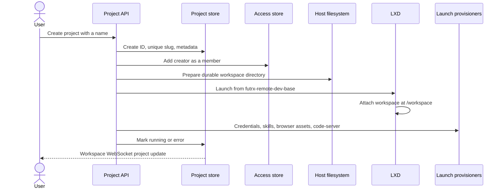
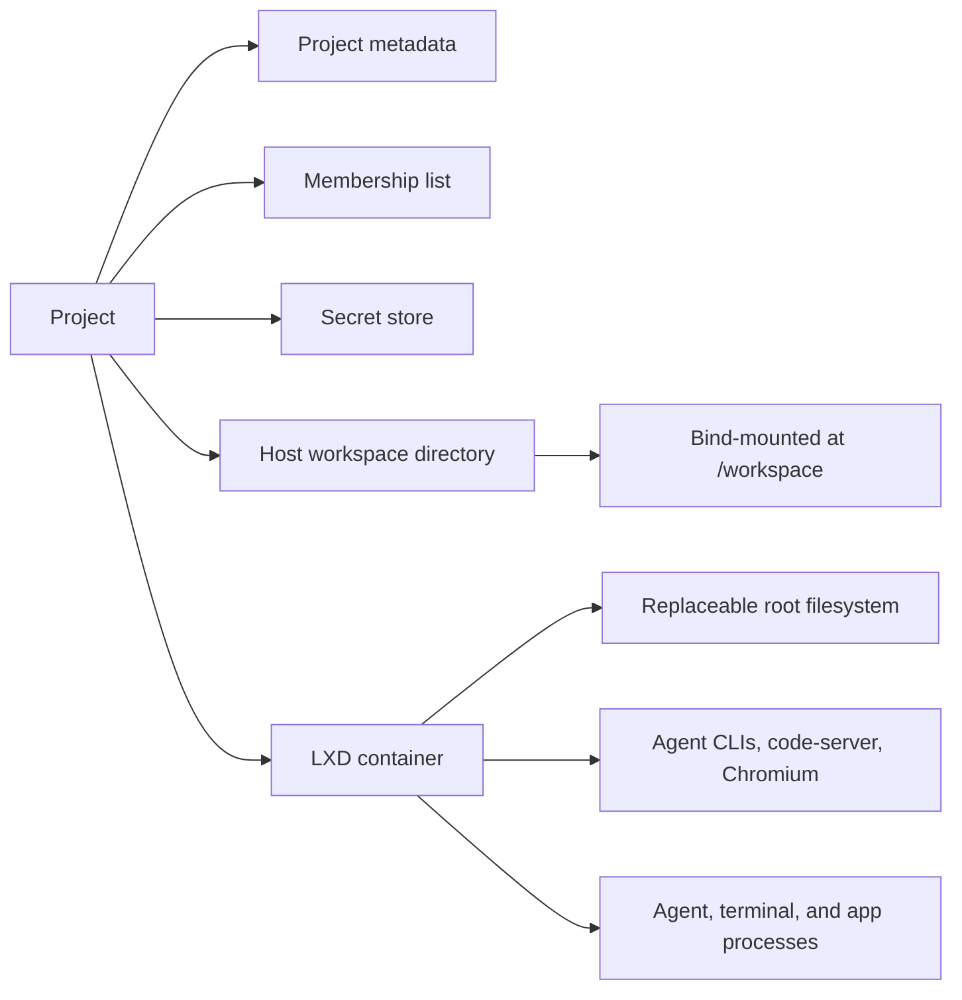
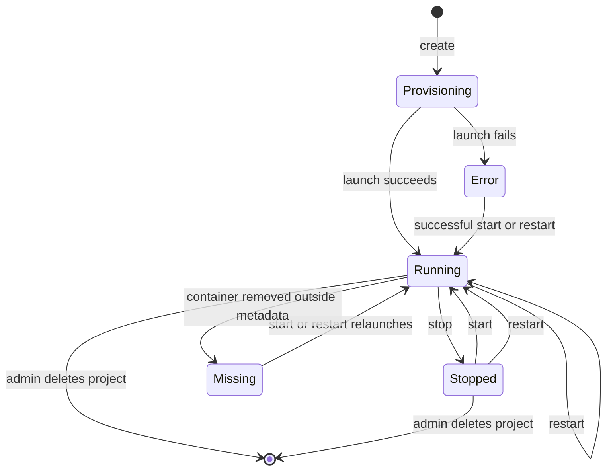
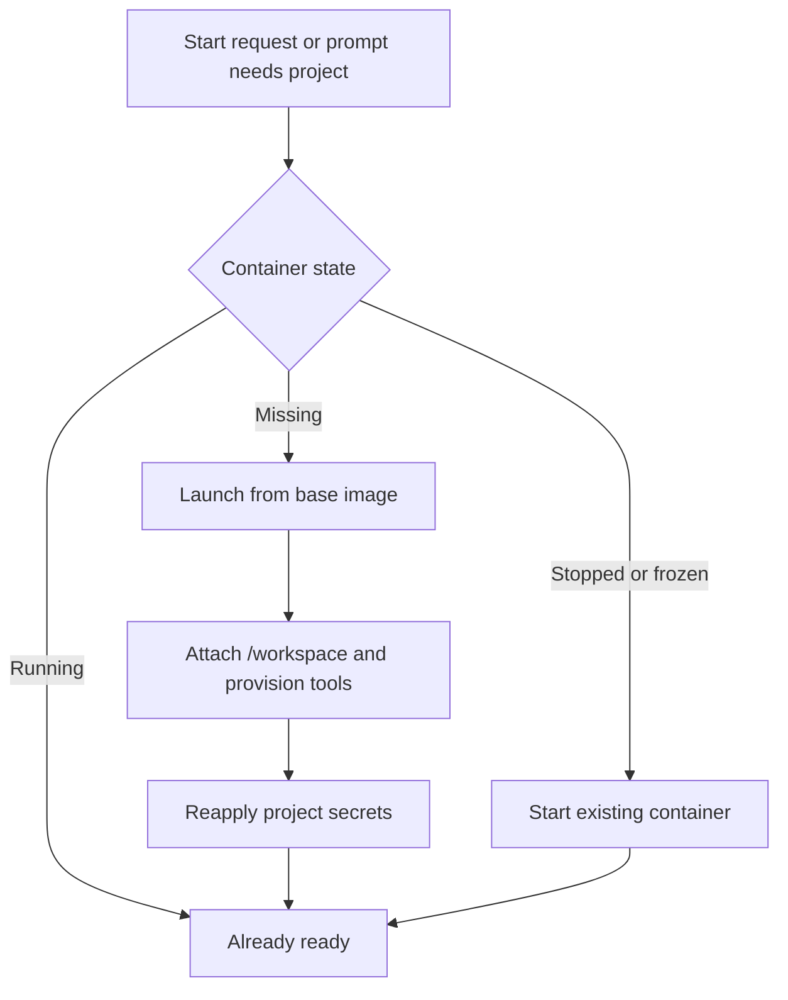
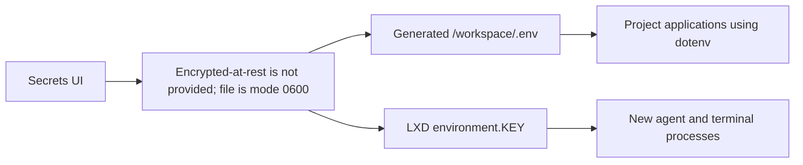

# Projects and containers

A project is a durable workspace directory plus an LXD container that supplies processes and tools. The directory survives container rebuilds; the container can be replaced.

## Project creation

The slug becomes the container name and is used in IDE and preview hostnames. Duplicate names receive a unique slug.

## Durable and replaceable parts

Files in `/workspace` survive stop, restart, container deletion during upgrades, and image replacement. Ad-hoc packages or files elsewhere in the container root filesystem do not.

## Lifecycle

At backend startup, reconciliation compares stored status with actual LXD state and reapplies the default and per-project resource envelope.

## Container launch contents

The reusable Ubuntu 24.04 base image contains:

- Node.js 22, Git, SSH client, `jq`, build tools, Python, and GitHub CLI.
- Claude Code, Codex, and Kimi Code at pinned versions.
- The Agent Browser stack and Chromium.
- `code-server` with on-demand startup.

Launch-time provisioning then:

1. Copies registered agent credentials into the container.
2. Links agent skill directories into the workspace.
3. publishes current browser scripts and browser skill.
4. applies browser process limits.
5. configures the project IDE.

These launch steps are best-effort so one optional capability does not prevent the container from starting.

## Start and restart behavior

Restart is host-driven and can recover a container whose internal processes are wedged. If the container is missing, restart delegates to the full launch path.

## Secrets

Project secrets are validated environment keys stored separately from the project files.

Adding or updating a secret writes the managed `.env` file and updates the container configuration. Deleting it removes both. Already-running processes retain their old environment until restarted.

## Sharing

- Project creators are added to the membership list automatically.
- Any current member can list members and add a registered user.
- Any current member can remove a user, but a non-admin cannot remove the final member.
- Administrators bypass membership checks and can always recover access.

## Resources and inspection

The project workspace page provides:

| Control or data | Details |
| --- | --- |
| Lifecycle | Start, stop, restart, and admin-only delete |
| Resource limits | CPU, memory, and disk overrides; admin-only changes |
| Runtime resources | Processes, CPU time, current/peak memory, swap, and disk usage |
| Container identity | Image, type, architecture, PID, creation, and last use |
| Network | Interfaces, addresses, traffic, MAC, and MTU |
| Operating system | Distribution, kernel, uptime, CPU count, and hostname |
| Agent state | Installed versions, instructions, and credential-bundle freshness |
| Recovery | Manual network repair and automatic IPv4 repair timer |

## Port discovery

The backend runs `ss` inside a running container and returns externally reachable TCP listeners. Loopback-only listeners are excluded. The browser drawer turns a selected listener into a `slug--port.dev` URL.

## Deletion

The current backend deletion path removes the LXD container, project metadata, host workspace directory, project secrets, and project access list. Chat records are stored separately; the project service does not currently cascade-delete chats that reference the deleted project.

## Code map

- Project policy: [`backend/internal/service/project/service.go`](../../backend/internal/service/project/service.go)
- Container lifecycle: [`backend/internal/service/container/lifecycle/service.go`](../../backend/internal/service/container/lifecycle/service.go)
- Project handler: [`backend/internal/transport/http/handlers/project_handler.go`](../../backend/internal/transport/http/handlers/project_handler.go)
- Project UI: [`frontend/src/ui/projects/ProjectContainersPage.tsx`](../../frontend/src/ui/projects/ProjectContainersPage.tsx)

