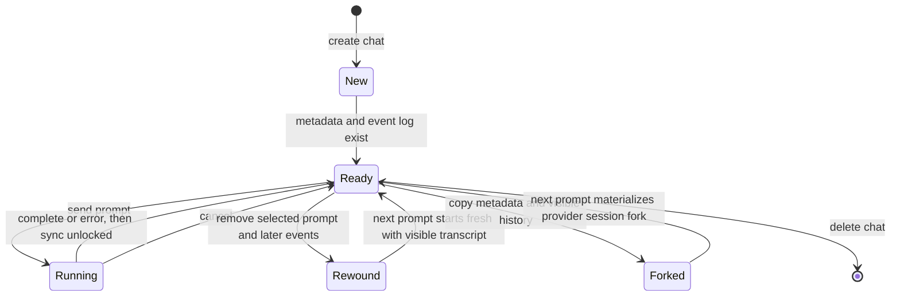
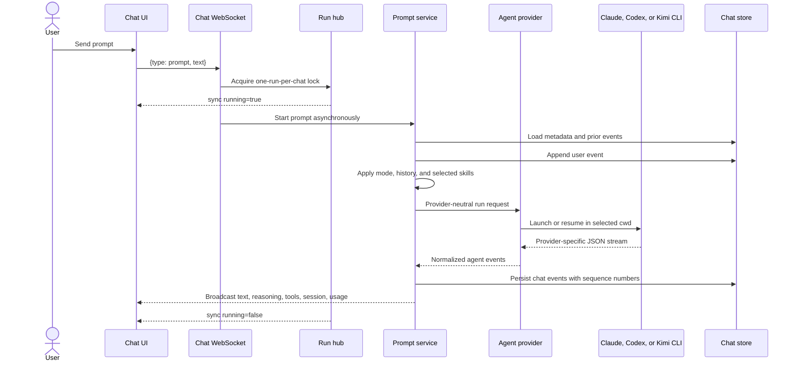
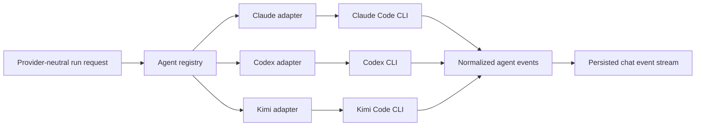
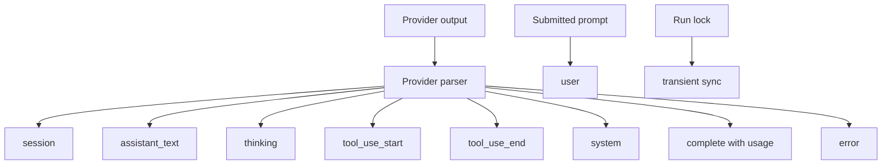
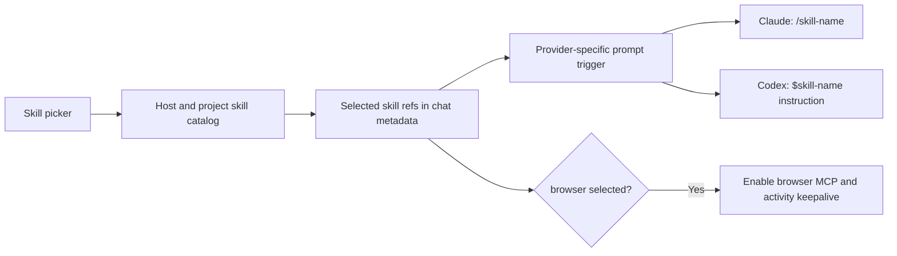

# Chat and agents

A chat stores conversation metadata and an ordered event log. A prompt run selects one provider, starts or resumes its CLI, normalizes the provider output, persists events, and broadcasts them to connected clients.

## Chat lifecycle

Chats may belong to a project or be loose. Project chats inherit the project workspace directory and access rules. A loose chat is visible to every registered user and cannot use the project terminal, preview, or project-specific features.

## Prompt execution

Only one prompt may run in a chat. A second send is queued in the browser until the run unlocks, or rejected by the server if another client races it.

## Provider abstraction

The run request contains the prompt, working directory, model, mode, prior provider session ID, fork flag, project ID, reasoning effort, service tier, and browser enablement.

Each provider has its own command builder and JSON parser. The shared layer only sees normalized session, text, reasoning, tool, completion, usage, and error events.

## Modes

| Mode | Prompt policy |
| --- | --- |
| Chat | Answer directly; avoid file changes unless requested |
| Plan | Inspect and propose a concrete plan before editing |
| Code | Normal implementation behavior; no extra mode prefix |
| Review | Lead with bugs, regressions, missing tests, and risks |
| Debug | Reproduce or localize first, then make the smallest root-cause fix |
| Full Auto | Continue through implementation and verification unless blocked |

Model and reasoning controls are stored per chat. The user's last selection also becomes the default for new chats. Service tier is exposed for Codex-style speed/cost selection.

## Event model

Persisted events receive a monotonic `seq`. On reconnect, the UI sends its last sequence so the server can replay only missed events. A transient `sync` event communicates the current run lock without entering history.

The UI groups text, reasoning, and tool events into readable assistant messages. Known read, write, edit, search, shell, and question tools receive specialized renderers; unknown tools use a generic view.

The thread also provides Markdown and syntax-highlighted code, grouped tool calls, visible reasoning blocks, token-usage totals, a working indicator, older-history loading, jump-to-latest behavior, and an error block. An `AskUserQuestion` tool call becomes a paged answer form whose submitted answer is sent as the next prompt.

## Skills

The catalog reads agent skill roots and, for project chats, project workspace skills after checking access. Provider changes clear incompatible selected skills. Current prompt injection is implemented for Claude and Codex; Kimi-selected skill references are stored but do not add a trigger prefix.

## Conversation controls

| Control | Behavior |
| --- | --- |
| Rename | Patches the chat title |
| Read/unread | Updates `lastReadAt` for sidebar indicators |
| Cancel | Cancels the active provider context and releases the run lock |
| Queue | Browser-session queue sends prompts one at a time after each run unlocks |
| Fork | Copies visible history and provider session IDs; next run forks without mutating the parent |
| Rewind | Deletes the selected event and everything after it; unavailable while running |
| Delete | Cancels an active run, then removes chat metadata and history |
| Load older | Pages backward through the JSONL event log |

Draft text and queued prompts live in in-memory frontend session state per chat. They survive switching chats in the same loaded page, but not a full page reload.

## Rewind and fresh-session context

Rewind clears provider session IDs. On the next run, the backend converts remaining user and assistant text into a bounded visible transcript and prepends it to the current request. This keeps the visible conversation meaningful while avoiding a resume into the discarded provider session.

## Code map

- Chat service: [`backend/internal/service/chat/service.go`](../../backend/internal/service/chat/service.go)
- Prompt service: [`backend/internal/service/prompt/service.go`](../../backend/internal/service/prompt/service.go)
- Run hub: [`backend/internal/service/runhub/hub.go`](../../backend/internal/service/runhub/hub.go)
- Agent model: [`backend/internal/agent/model.go`](../../backend/internal/agent/model.go)
- Frontend chat hook: [`frontend/src/state/hooks/chat/useChat.ts`](../../frontend/src/state/hooks/chat/useChat.ts)
