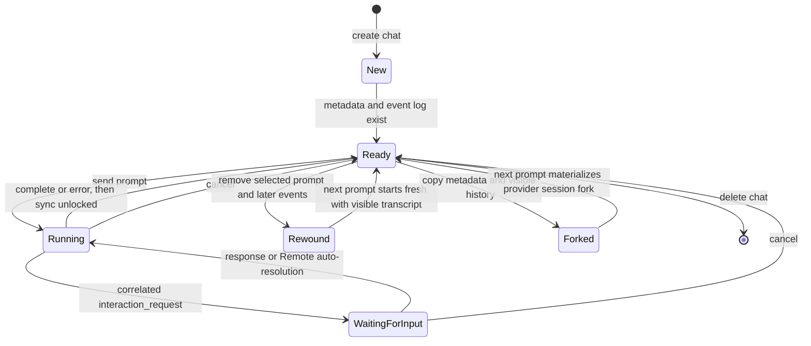
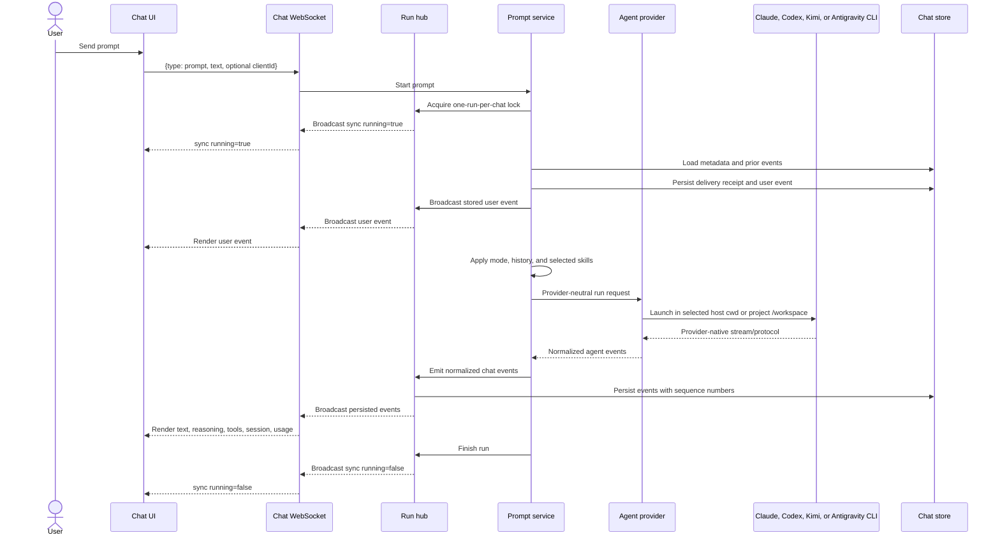
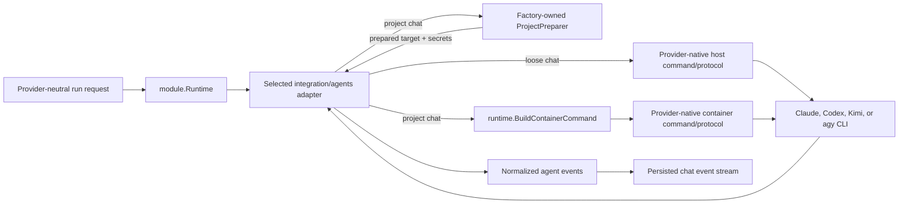
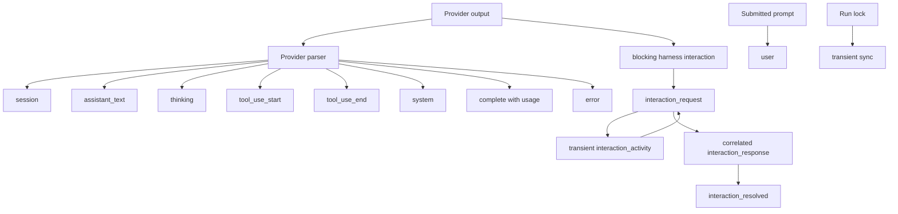
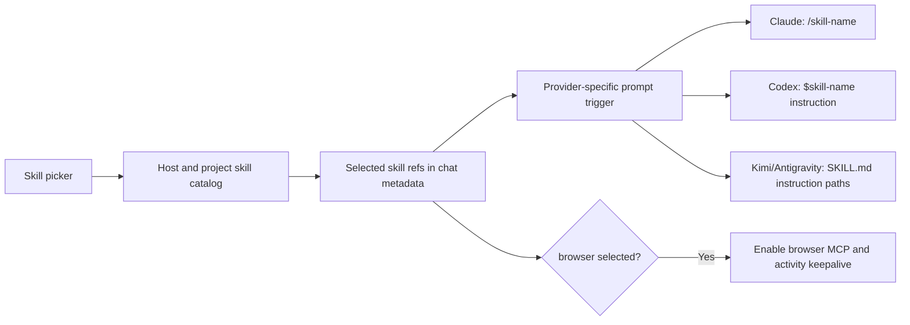

# Chat and agents

A chat stores conversation metadata and an ordered event log. A prompt run selects one provider, starts or resumes its CLI, normalizes the provider output, persists events, and broadcasts them to connected clients.

## Chat lifecycle

Chats may belong to a project or be loose. Project chats inherit the project workspace directory and access rules. A loose chat is visible to every registered user and cannot use the project terminal, preview, or project-specific features. Its approval-free provider CLI currently runs directly as the backend's host service user—root in the production unit—with the host environment and filesystem rather than a project container. Loose chats are therefore outside the project-isolation contract.

## Prompt execution

Only one prompt may run in a chat while the current backend process owns its in-memory lock. A second send is queued in the browser until the run unlocks, or rejected by the server if another client races it. Provider children may survive a backend restart while that lock and cancellation state do not, so the control plane does not yet reattach to an orphaned run.

## Provider abstraction

The run request contains the prompt, working directory, model, mode, prior
provider session ID, fork flag, project ID, reasoning effort, service tier,
browser and scheduled-tool enablement, and short-lived backend runtime
environment.

The compiled-in integrations are composed through validated provider-owned
factories. Each `backend/internal/integration/agents/<id>/factory.go` attaches
the provider's provisioning `Profile()` separately from its public descriptor
and declares the provider-neutral extension contract: stable ID and label,
default-provider flag, host/project execution scopes, authentication
mode/instructions and access-gate policy, resume/fork support, skill strategy,
browser and scheduled-tool support, legacy skill roots, and the few
project-preparation differences it needs.

`Catalog.Build` receives application-facing `BuildDependencies` containing the
project resolver, full container ports, and global credential-sync timeout.
For every project-scoped module, `module.Factory` constructs the shared
`ProjectPreparer` from the exact validated profile and its
`ProjectPreparationPolicy`. It then invokes the provider build callback with
only that preparer, the optional post-run `CredentialCollector`, the sync
timeout, and an independent validated profile clone. Those callback
dependencies do not expose project-service models or the full container port
set. Current adapters use the shared preparer; direct project-service imports
or copied CLI/workspace/browser/lifecycle orchestration would violate the
integration contract. The callback creates the runtime provider and optional
auth binding; mutable runtime and auth state is fresh for every catalog build.

`AuthNone` modules omit the binding; all other modes require one. Startup
validation rejects inconsistent IDs, auth bindings, multiple defaults, project
modules without profiles, invalid preparation policy, fork without resume,
external-auth gate providers, and duplicate or overlapping persistent mounts.
Registration order is explicit in `internal/config/agents.go` and is preserved
in provisioning, runtime, authentication, and capability views.
`Catalog.Build` exposes those live views through one `module.Runtime`; adding
an integration does not depend on package `init` hooks. Every registered
function satisfies `module.FactoryBuilder` at compile time.
Authenticated service startup also requires at least one managed or no-auth
module marked as an access-gate provider, so onboarding cannot deadlock behind
a catalog that has no observable way to become ready.
For a project-capable agent, the profile is the concrete container contract:
CLI binary, strict semver pin, version-command arguments, install/repair
policy, credential synchronization, persistent directories,
shared instruction destination, workspace-skill compatibility links, and any
browser MCP templates. The built-ins define their module and provisioning
policy in protected provider-local `factory*.go`, `profile*.go`, `install*.go`,
`provisioning*.go`, and `assets/` paths under `internal/integration/agents`.
Changes there require a minor/major full-infrastructure release.

Execution scope is enforced at the service boundary. `host` permits loose-chat
execution and host capability discovery; `project` permits project chats,
project skills, and container provisioning. Project-capable modules must have
a profile. A host-only module may include a profile when it runs a local CLI,
or omit one when it calls a remote integration. Codex is the current explicit
built-in default; if no default is declared, the catalog chooses the first
compatible module in stable registration order.

Each provider has its own command builder and parser. Claude, Codex, and Kimi
produce structured streams; Antigravity print mode emits plain text, and its
adapter recovers the conversation ID from the CLI brain directory. The shared
layer sees whichever normalized session, text, reasoning, tool, completion,
usage, and error events that provider can supply.

## Modes

Remote does not define workflow prompts. Although the persisted mode contract
still recognizes `default` and the older `plan` value, every built-in adapter
currently advertises **Default only**. The selector is therefore hidden. A
provider change resets the chat mode to Default. If an old chat still stores
Plan, the prompt boundary rejects it without changing the stored value. The
user must explicitly switch to Default before resending. This fail-closed
handoff prevents a read-only expectation from silently becoming a mutable run.
Every provider adapter independently rejects Plan before launch as a final
boundary.

Plan remains gated until Remote can honor each harness's complete lifecycle:

| Provider | Why Plan is not exposed |
| --- | --- |
| Claude | Remote's current `claude -p` adapter does not implement Claude Code's `--permission-prompt-tool` MCP bridge, so it cannot complete the blocking `AskUserQuestion` and `ExitPlanMode` approval transition. |
| Codex | App-server exposes a native Plan collaboration mode, and Remote now bridges blocking user questions, but Remote does not yet model the plan-ready **Approve**/**Revise** transition. |
| Kimi | The pinned CLI rejects `--plan` together with the `-p` transport Remote requires. Its provider effort metadata is also not a runnable print-mode control. |
| Antigravity | `agy --print` provides output but no structured control/approval round trip for leaving or approving Plan. |

Default project runs remain approval-free within the project container. Hiding
Plan prevents Remote from promising a read-only or approval workflow that the
selected transport cannot complete; it does not add a human confirmation gate
to Default.

Model, reasoning, and speed controls are stored per chat. The user's last
selection also becomes the default for new chats. Codex forwards service tiers
through app-server; Claude Fast mode is applied per run through CLI settings
for Auto and Opus selections.

## Capability discovery

`GET /api/agent-capabilities` returns one provider-neutral catalog built from
the registered backend agents. With `projectId=<id>`, the request is authorized
against that project and probes the CLIs inside its current container through
`lxc exec`; without `projectId`, it probes the host CLIs for a loose chat.
Adding `refresh=1` requests fresh discovery for that scope. Discovery does not
start a stopped or missing project container; start the project before probing
it or the provider adapters will return degraded results.

On a cache miss, the backend probes all registered providers compatible with
the selected host/project execution scope concurrently and
preserves registry order in the response. One global
`AGENT_CAPABILITY_TIMEOUT` bounds each provider's complete discovery operation
(30 seconds by default; `0` disables the deadline). Each adapter normalizes
the CLI-specific output into models and only the controls that the current
transport can execute end to end. A failed probe can return a
conservative fallback. A partial probe preserves usable live data when possible
and attaches a concise `warning`; provider failures do not make the whole
catalog request fail.

Each provider owns its parser because the CLIs expose different surfaces. The
table describes the successful live-discovery path; failures can produce a
smaller fallback catalog or partially resolved labels and controls.

| Provider | Discovery source |
| --- | --- |
| Codex | App-server `initialize`, its response, then the required `initialized` notification before every page of `model/list` and `collaborationMode/list`; `codex debug models` is the structured fallback. Collaboration modes are observed but Plan is not exposed. |
| Claude | Safe-mode `/model` and `/effort` probes, with safe-mode `--help` as the effort fallback. Aliases are resolved to versioned labels without loading project/user hooks, MCP servers, plugins, skills, or instructions. Eligible Auto/Opus Fast controls remain available; mode is Default only. |
| Kimi | `kimi provider list --json` supplies configured aliases and provider/display names; the plain listing supplies the active default. Remote does not probe help or advertise provider effort/Plan metadata because the print adapter cannot forward it. |
| Antigravity | `agy models` supplies stable model slugs used as IDs plus separate display labels; `agy --help` supplies effort choices. Native mode flags are not advertised through the print adapter. |

The normalized model record owns its reasoning-effort and service-tier lists,
so the frontend can update dependent selectors when a model changes without a
compiled model catalog. Mode discovery currently returns Default only. A
native Plan value can be reintroduced only after the provider adapter and
shared interaction state machine can complete its lifecycle.
Provider-required aliases remain model IDs, while the user-facing labels carry
the resolved version and variant. This is particularly important for dynamic
Claude aliases and Antigravity's parenthesized thinking variants.

Each provider result also carries descriptor metadata: the module default flag,
execution scopes,
authentication mode and optional instructions, session resume/fork support,
skill strategy, browser-tool support, and scheduled-tool support. An adapter
can provide a structured `unavailableReason` for a provider that is installed
but cannot currently run; this is separate from partial-discovery warnings.
The catalog uses the registered provider's ID and the descriptor's label as
authoritative rather than trusting CLI output for identity.

Discovery and launch support must match. Kimi provider configuration can
contain effort choices, and the CLI has a native Plan flag, but neither is
included in the normalized catalog because the current `-p` run adapter cannot
honor those selections. Kimi therefore relies on its configured model/default
effort and runs in Default.

### Capability cache and refresh

The authoritative cache lives only in the backend process and is keyed by the
execution environment:

- `host` for loose-chat discovery;
- `project:<project-id>:<container-name>` for project discovery.

A catalog in which every provider is live and warning-free is cached for 24
hours. If any provider uses fallback data or carries a warning, the entire
scope is cached for 2 hours so Remote retries sooner. Expired entries are
removed lazily on the next request. Concurrent discovery requests for one
scope share the same in-flight work, and stored/returned results are cloned so
callers cannot mutate the shared entry.

There is no persistent cache and no separate cache-delete endpoint. A backend
restart or deployment clears every entry. `refresh=1` bypasses a completed
entry; if discovery for the same scope is already running, the request joins
that flight, whose result replaces the entry.
Changing a CLI version, CLI configuration, or account entitlement does not by
itself notify the backend cache.

The frontend separately retains the last response in page memory, keyed by
normalized user plus host/project scope. It always consults the backend when a
scope mounts, keeps the previous response visible during a request, and
coalesces duplicate requests in that page. This browser state does not set the
catalog TTL and disappears on reload.

The composer **Refresh models** action uses `refresh=1`. A managed provider's
authenticated flag changing, or a login reaching completed with a new start
revision, requests a refresh for the scopes currently open in that browser;
intermediate login-status changes do not. Using the sidebar's project **Start**
action requests one for that project. The Project workspaces Start/Restart
actions do not invalidate this cache. The project probe still sees the
credentials and configuration currently present inside the container;
credential propagation performed later during a run has no follow-up
invalidation. A login performed manually in a project terminal, including
Antigravity login, is not observable by the frontend; use **Refresh models**
afterward.

For loose chats, the Antigravity adapter probes host `agy` state. Remote has no
host Antigravity sign-in UI, and a loose chat has no project Terminal, so the
supported interactive sign-in flow is a project chat. An operator can prepare
host `agy` outside Remote, but that is host-level execution outside the
project-local authentication and isolation workflow.

## Event model

Persisted events receive a monotonic `seq`. On reconnect, the UI sends its last sequence so the server can replay only missed events. A transient `sync` event communicates the current run lock without entering history.

The UI groups text, reasoning, and tool events into readable assistant messages. Known read, write, edit, search, shell, and question tools receive specialized renderers; unknown tools use a generic view.

The thread also provides Markdown and syntax-highlighted code, grouped tool
calls, visible reasoning blocks, token-usage totals, a working indicator,
older-history loading, jump-to-latest behavior, and an error block. Question
cards have two deliberately different submission paths:

- a Codex app-server `requestUserInput` persists an `interaction_request` while
  the app-server scanner continues handling later notifications. The browser sends
  `interaction_response` with the request ID and answers keyed by question ID;
  Remote resumes that JSON-RPC request and persists `interaction_resolved`;
- a legacy/non-interactive `AskUserQuestion` tool card has no live correlated
  request, so its text summary is sent as a new prompt after the run unlocks.

Pending interaction correlation is backend-memory state. The frontend enables
submission only while the chat is streaming and its socket is open and
synchronized; the backend accepts it only while that exact request remains
pending. Codex non-blocking questions auto-resolve empty after 120 seconds, but
the final 60 seconds are shown as a countdown and the first browser selection,
keypress, or paste sends `interaction_activity` and snoozes that deadline.
Freeform-only `options:null` questions remain answerable, and an option can be
submitted with an additional note. Secret values use a masked input and are not
written to Remote chat events or browser storage, but they are sent to Codex and
may persist in Codex-owned rollout/session state. Cancellation or restart makes
a late response invalid.

Antigravity currently contributes streamed assistant text and session/error
state, not structured reasoning, tools, or usage.

## Skills

The catalog reads the canonical host or project skill roots and any
provider-declared legacy roots after checking execution scope and project
access. Provider changes clear incompatible selected skills. The module's
declared skill strategy determines prompt preparation: Claude receives
slash-style skill triggers, Codex receives dollar mentions, and Kimi and
Antigravity receive explicit paths to the selected `SKILL.md` files. The
**Scheduled Tasks** skill also receives a scoped schedule capability. Browser
MCP preparation is a separate feature flag and is currently declared only by
Claude and Codex.

## Conversation controls

| Control | Behavior |
| --- | --- |
| Rename | The API can patch the chat title; the current UI has no manual rename control |
| Read/unread | Updates `lastReadAt` for sidebar indicators |
| Cancel | Signals the active provider context; the run lock stays reserved until provider output and teardown finish |
| Queue | Per-tab `sessionStorage` queue sends prompts one at a time after each run unlocks; busy rejections retry, while semantic rejections return to the draft for explicit review |
| Fork | Copies visible history and provider session IDs; next run forks without mutating the parent |
| Rewind | Deletes the selected event and everything after it; unavailable while running |
| Delete | Exclusively cancels and waits for an active run to quiesce, then removes chat metadata and history |
| Load older | Pages backward through the JSONL event log |

Draft text and queued prompts are mirrored into per-tab `sessionStorage` by
chat ID. They survive switching chats, navigation, and reloads in the same tab,
but are not server-authoritative and do not cross tabs, browsers, devices, or
users. A background chat's queue waits until that chat is active again.

Interactive prompt messages include the provider and mode displayed when the
user sent them. After reserving the run, the prompt service compares those
values with current chat metadata. A stale tab is rejected without persisting a
user event or changing metadata. Accepted client IDs are hashed into hidden,
non-rewindable chat delivery metadata, so an acknowledgement lost during a
disconnect can be retried without executing the prompt twice. Chat preference
updates and rewinds also own the same idle transition as run reservation,
closing their update/run races. Scheduled turns omit the browser expectation
but still validate the current stored mode on every fire; an unsupported mode
fails every occurrence until a user explicitly changes it.

## Scheduled turns

The host scheduler starts a due task through the same prompt service and run
hub used by an interactive WebSocket prompt. It persists the scheduled
envelope as a user event, resumes the chat's selected provider session, and
broadcasts ordinary chat events.

Interactive turns receive a short-lived `manage` capability only when the
**Scheduled Tasks** skill is selected. Scheduled turns receive a narrower
`complete-self` capability tied to one task and one run. Agent-created tasks
start paused and require a human **Arm** action. See
[Scheduled tasks](06-scheduled-tasks.md).

## Rewind and fresh-session context

Rewind clears provider session IDs. On the next run, the backend converts remaining user and assistant text into a bounded visible transcript and prepends it to the current request. This keeps the visible conversation meaningful while avoiding a resume into the discarded provider session.

## Code map

- Chat service: [`backend/internal/service/chat/service.go`](../../backend/internal/service/chat/service.go)
- Prompt service: [`backend/internal/service/prompt/service.go`](../../backend/internal/service/prompt/service.go)
- Run hub: [`backend/internal/service/runhub/hub.go`](../../backend/internal/service/runhub/hub.go)
- Agent model: [`backend/internal/agent/model.go`](../../backend/internal/agent/model.go)
- Agent module contract and runtime: [`backend/internal/service/agent/module/`](../../backend/internal/service/agent/module/)
- Agent authentication: [`backend/internal/service/agent/auth/`](../../backend/internal/service/agent/auth/)
- Agent composition root: [`backend/internal/config/agents.go`](../../backend/internal/config/agents.go)
- Provider-owned adapters and factories: [`backend/internal/integration/agents/`](../../backend/internal/integration/agents/)
- Project-run preparation: [`backend/internal/service/agent/execution/`](../../backend/internal/service/agent/execution/)
- Capability catalog: [`backend/internal/service/agent/capability/`](../../backend/internal/service/agent/capability/)
- Frontend chat hook: [`frontend/src/state/hooks/chat/useChat.ts`](../../frontend/src/state/hooks/chat/useChat.ts)
