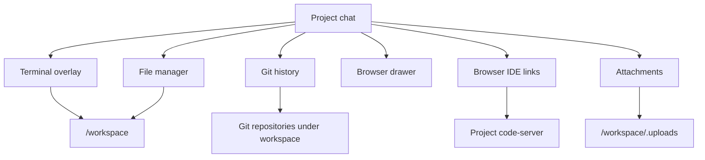
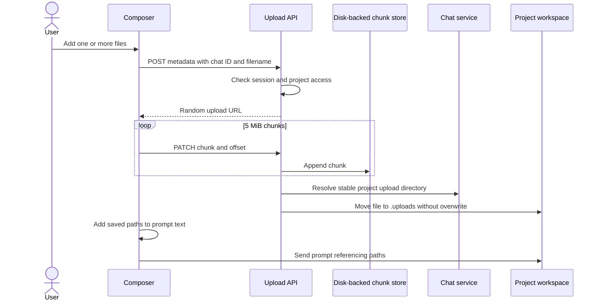
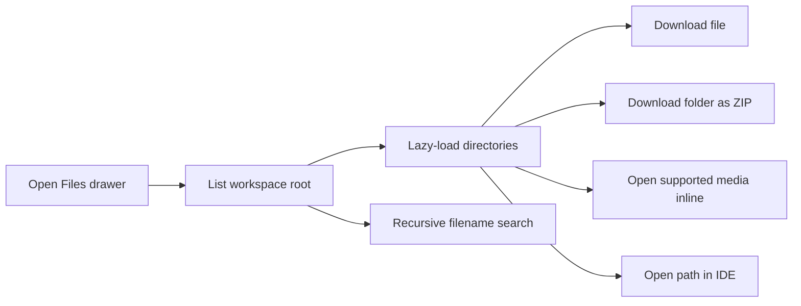
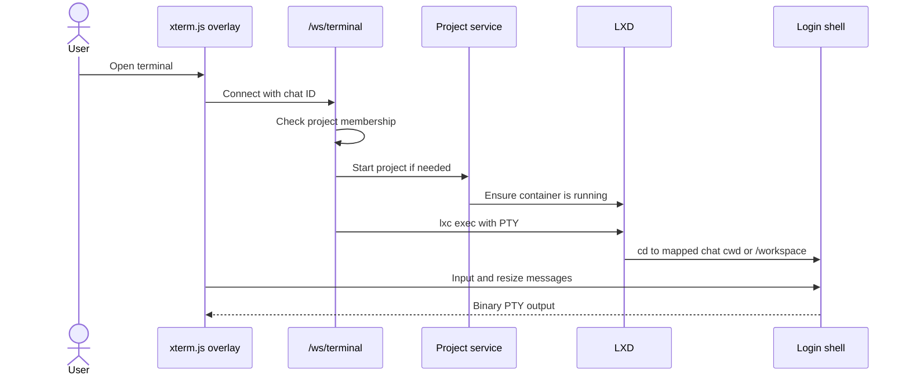
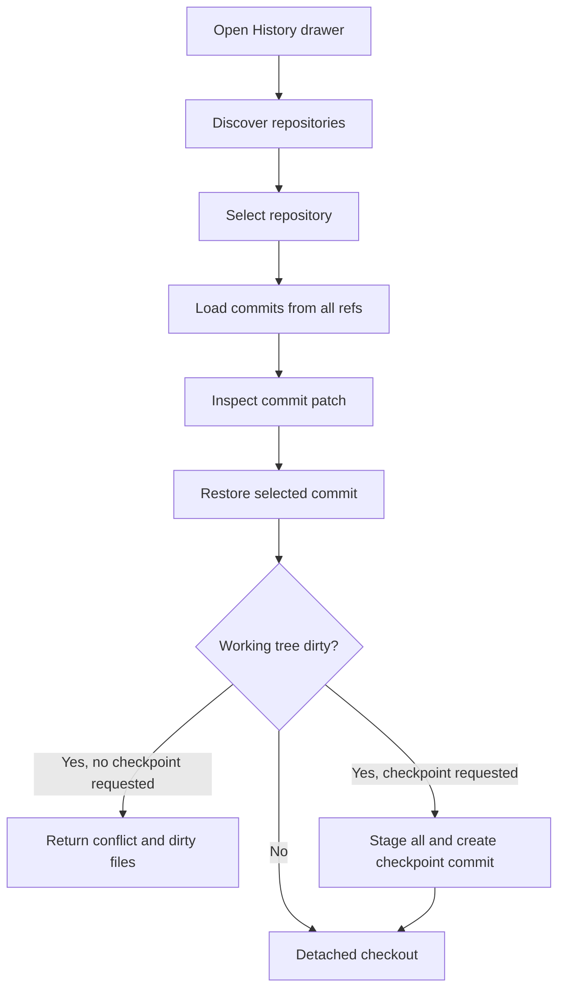
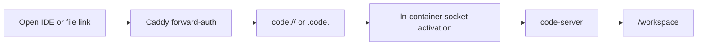

# Workspace tools

The chat header opens four views over the same project workspace: terminal, files, Git history, and browser. IDE links can also open workspace files in code-server.

## Tool map

## Attachments

Files can be selected, dragged, or pasted into the composer. Uploads use the resumable tus protocol.

Important behavior:

- Default maximum upload size is 10 GiB and can be changed with `UPLOAD_MAX_BYTES`.
- Chunks live under the application data directory, not RAM-backed `/tmp`.
- Final files are mode `0644` and owned by the container-mapped root user.
- `.uploads/.gitignore` ignores every attachment.
- Existing filenames are not overwritten.

## File manager

The backend resolves all paths relative to the chat working directory and rejects traversal. Listings and search results can report truncation rather than returning unbounded data. Inline media receives a restrictive content security policy.

## Terminal

The terminal exists only for chats attached to a project. Each open overlay starts a new interactive `bash -l` process. Closing the socket kills that PTY process; it is not a persistent tmux session.

The backend also retains lower-level tmux session APIs and a `/ws` tmux PTY bridge. These are not used by the current main workspace UI, but chats can still carry a `tmuxSession` and resolve their working directory from it.

## Git history

The History drawer discovers Git repositories at the workspace root and up to a bounded depth, excluding heavy or generated directories.

Restore resolves the commit, optionally creates a safety checkpoint using the `remote.futrx` identity, and checks out the target in detached HEAD state. Git commands use an explicit safe directory and bounded timeouts.

## Browser IDE

Each project has an on-demand code-server instance on container port `8842`.

Caddy disables upstream keep-alive so code-server can stop after its idle window. Platform session cookies are removed before requests reach the container.

## IDE and media links in chat

Markdown links are inspected by the frontend. Workspace paths can be converted into backend `ide-open` or `media-open` routes. The backend validates the path, then either redirects to code-server or serves a supported image/audio/video file inline.

## Code map

- Upload handler: [`backend/internal/transport/http/upload_tus.go`](../../backend/internal/transport/http/upload_tus.go)
- Workspace files: [`backend/internal/service/workspacefiles/service.go`](../../backend/internal/service/workspacefiles/service.go)
- Terminal socket: [`backend/internal/transport/ws/container_terminal_socket.go`](../../backend/internal/transport/ws/container_terminal_socket.go)
- Git history: [`backend/internal/service/githistory/service.go`](../../backend/internal/service/githistory/service.go)
- IDE service: [`backend/internal/service/workspaceide/service.go`](../../backend/internal/service/workspaceide/service.go)

