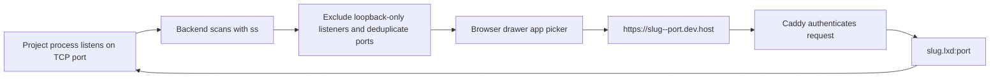
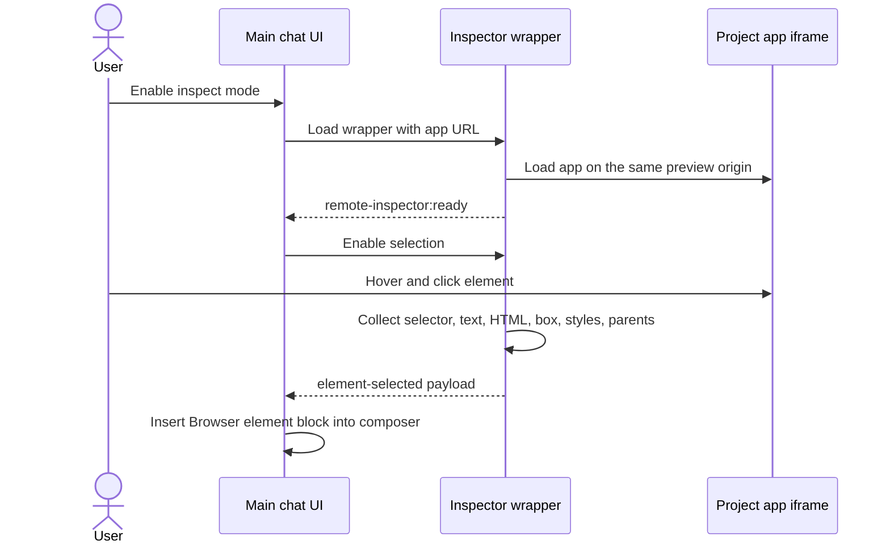
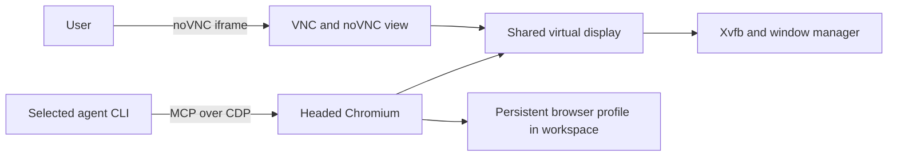
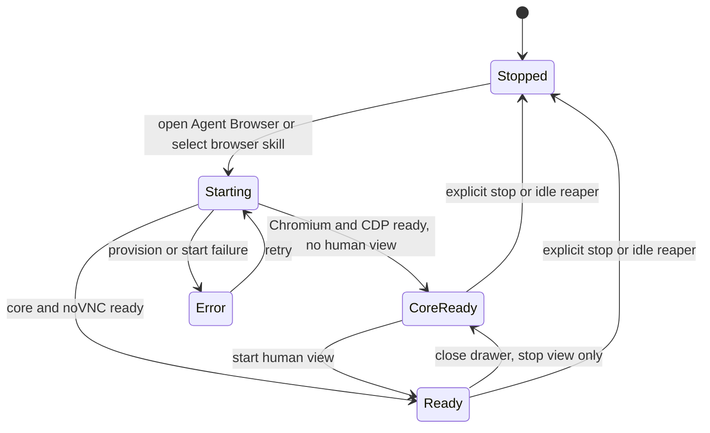
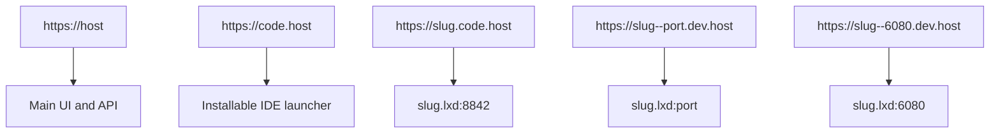
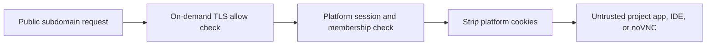

# Previews and browser features

There are two browser systems:

| System | Purpose | Browser process |
| --- | --- | --- |
| App preview | Show a web app already running in the project | The user's normal browser loads the project app in an iframe |
| Agent Browser | Share a signed-in, headed browser between user and agent | Chromium runs inside the project container |

## App discovery and preview URLs

The UI prefers a preview URL recently mentioned in chat when it matches the current project and a discovered port. Otherwise it selects a discovered listener.

Preview host rules:

- Port must be between 1024 and 65535.
- On-demand TLS asks the backend to confirm the slug is a real project before certificate issuance.
- The authenticated user must be an admin or project member.
- Platform cookies are stripped before the request enters project code.

## Preview inspection

Inspect mode wraps the selected app with `/__remote_inspector` on the same preview origin. Same-origin access lets the wrapper inspect the inner app iframe.

The payload is bounded and includes enough layout and accessibility context for an agent to identify the selected element. Selecting an element exits inspect mode.

## Agent Browser architecture

The user can sign in visually while the agent controls the same Chromium session. Browser profile data lives under the project workspace, so site logins survive container replacement.

## Agent Browser lifecycle

Frontend behavior:

- Opening Agent Browser calls the start endpoint, polls every 1.5 seconds, and sends a status heartbeat every 15 seconds.
- Closing the drawer stops only the noVNC view; the agent-facing core stays available.
- Explicit Stop tears down the complete browser stack but keeps the profile.

Backend behavior:

- Starting the browser first ensures the project container is running.
- Provisioning installs missing browser packages and republishes versioned scripts.
- A selected `browser` skill enables the provider's browser MCP config.
- Active browser-enabled prompts send a keepalive every minute.
- A reaper checks every minute and stops a browser after 20 minutes without pane or agent activity, unless a viewer is connected.

## URL and proxy layout

The installer configures host DNS resolution for `.lxd` names through the LXD bridge. Caddy handles public HTTPS and routes to private container addresses.

## Security boundary

Project apps may set and receive their own cookies. Only the platform's session, OAuth-state, and return-location cookies are removed.

## Code map

- App scanning: [`backend/internal/integration/containers/listeners/scanner.go`](../../backend/internal/integration/containers/listeners/scanner.go)
- Browser drawer: [`frontend/src/ui/chat/browser/BrowserDrawer.tsx`](../../frontend/src/ui/chat/browser/BrowserDrawer.tsx)
- Inspector handler: [`backend/internal/transport/http/handlers/browser_inspector_handler.go`](../../backend/internal/transport/http/handlers/browser_inspector_handler.go)
- Agent Browser service: [`backend/internal/service/container/browser/service.go`](../../backend/internal/service/container/browser/service.go)
- Caddy routes: [`infra/templates/Caddyfile.tmpl`](../../infra/templates/Caddyfile.tmpl)
