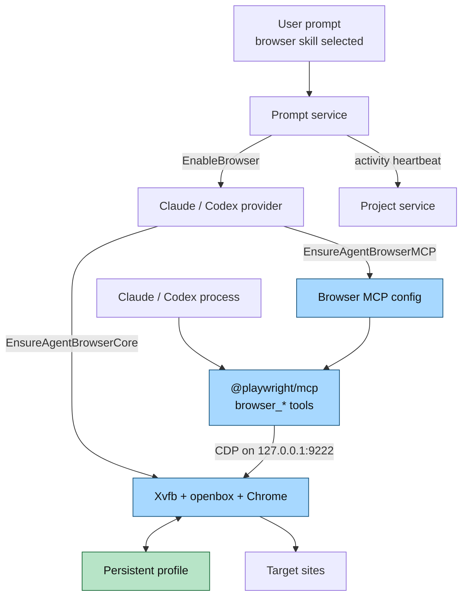

# Agent Browser Flow: Agent Run

Related flows:

- [Overview flow](agent-browser-flow-overview.md)
- [Human view flow](agent-browser-flow-human-view.md)
- [Lifecycle flow](agent-browser-flow-lifecycle.md)

This is the path used when a prompt runs with the `browser` skill selected.

The provider starts the core browser stack automatically, so the agent does not
need the user to open the pane just to start browsing. CDP remains loopback-only
inside the project container.
