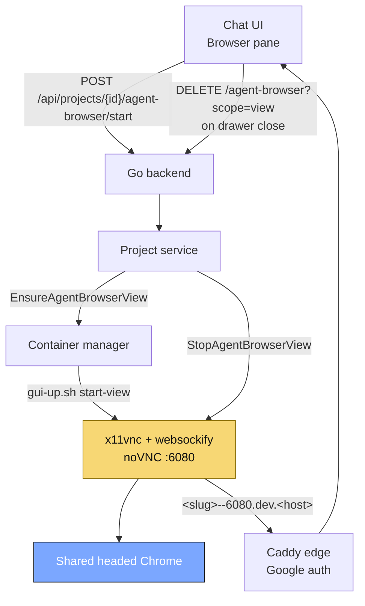

# Agent Browser Flow: Human View

Related flows:

- [Overview flow](agent-browser-flow-overview.md)
- [Agent run flow](agent-browser-flow-agent-run.md)
- [Lifecycle flow](agent-browser-flow-lifecycle.md)

This is the path used when the user opens the Browser pane to watch the
session or log in by hand.

Only noVNC port `6080` is exposed, and it is exposed through the auth-gated
dev-URL proxy. Closing the drawer stops only x11vnc/websockify; the Chrome
core can keep running for the agent.
