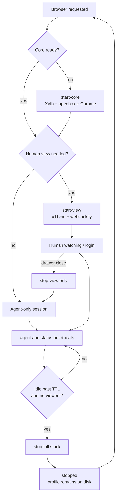

# Agent Browser Flow: Lifecycle

Related flows:

- [Overview flow](agent-browser-flow-overview.md)
- [Human view flow](agent-browser-flow-human-view.md)
- [Agent run flow](agent-browser-flow-agent-run.md)

This flow explains when the stack starts, what stops, and how idle cleanup
works.

The profile is not deleted when the stack stops. On the next start, Chrome
comes back with the same profile and the same user-performed logins.
