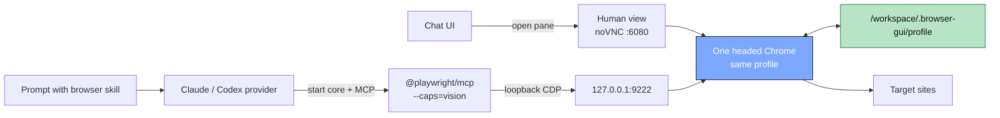

# Agent Browser Flow: Overview

Companion pages:

- [Human view flow](agent-browser-flow-human-view.md)
- [Agent run flow](agent-browser-flow-agent-run.md)
- [Lifecycle flow](agent-browser-flow-lifecycle.md)
- [Main Agent Browser doc](agent-browser.md)

The Agent Browser has two access paths into one shared Chrome session:

- The human path exposes pixels through noVNC on port `6080`.
- The agent path drives Chrome through CDP on `127.0.0.1:9222`.

Key invariant: the human and the agent do not get separate browsers. They both
attach to the same headed Chrome, so the agent can reuse cookies from the
login the user performed by hand.
