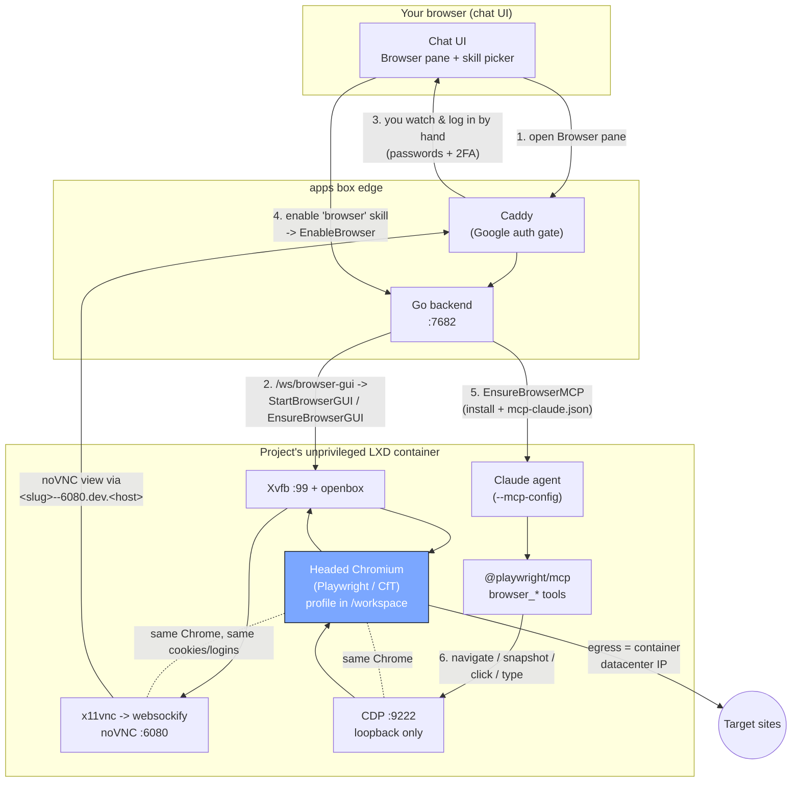

# Agent Browser

A real headed Chromium running **inside each project's unprivileged LXD
container**, rendered on a virtual display. One shared session is exposed two
ways onto the *same* Chrome: a **noVNC web view** the user watches and logs in
through (port `6080`), and a **loopback CDP port** the agent drives via
Playwright (`9222`). Because both attach to the same browser, the agent
inherits whatever the user is logged into. The Chrome profile lives under
`/workspace/.browser-gui/profile`, so logins persist across container restarts.

## Flow

## Reading it

- **Steps 1-3 (user side):** opening the Browser pane drives the backend to
  spin up the in-container GUI stack (`Xvfb -> openbox -> Chromium -> x11vnc ->
  websockify/noVNC`), which streams back through Caddy so the user can **watch
  and log in by hand**. The agent never types credentials.
- **Steps 4-6 (agent side):** selecting the `browser` skill flips
  `EnableBrowser`, which wires `@playwright/mcp` into the Claude launch via
  `--mcp-config`; the agent then drives over the **loopback CDP port**.
- **The shared Chrome** (highlighted) is what both paths attach to, so the
  agent inherits the user's logged-in cookies.

## Notable design points

- **Only `6080` (noVNC) is reachable from outside**, surfaced through the
  dev-URL proxy at `<slug>--6080.dev.<host>` and gated by the platform's
  Google auth at the Caddy edge. **CDP `9222` is loopback-only and never
  proxied out.**
- **Egress is the container's own datacenter IP** (no traffic routing in this
  version), so strict providers (Google, X) may show a "verify it's you"
  challenge -- which is why logins are done by hand through the pane.
- **Closing the drawer does NOT stop the browser:** the session is shared with
  the agent over CDP, so it only tears down on an explicit stop.
- **Resource caps:** 2 CPU / 3 GB, `security.nesting=true`.
- Uses **Playwright's Chromium (Chrome for Testing)**, not
  `google-chrome-stable`, because in an unprivileged LXC the latter cannot open
  the CDP socket (`CreatePlatformSocket: EPERM`).
- Distinct from the **Browser drawer** (previewing this project's own dev
  server) and from `scripts/browser.mjs` (one-off screenshot of a public URL).

## Code map

| Concern | File |
|---|---|
| GUI launcher (Xvfb -> Chromium -> noVNC) | `backend/internal/manager/containers/templates/gui-up.sh` |
| Provision/start/stop the GUI stack | `backend/internal/manager/containers/browser_gui.go` |
| Install `@playwright/mcp` + push config | `backend/internal/manager/containers/browser_mcp.go` |
| The `browser` skill playbook | `backend/internal/manager/containers/templates/skills/browser/SKILL.md` |
| Ship the skill into the workspace | `backend/internal/manager/containers/browser_skill.go` |
| Lifecycle control channel | `backend/internal/transport/ws/browser_gui_socket.go` |
| Skill -> EnableBrowser -> MCP wiring | `backend/internal/service/prompt/service.go`, `backend/internal/agent/providers/claude/command.go` |
| Project-service orchestration | `backend/internal/service/project/service.go` (`StartBrowserGUI`) |
