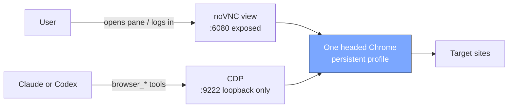

# Agent Browser

A real headed Chromium running **inside each project's unprivileged LXD
container**, rendered on a virtual display. One shared session is exposed two
ways onto the *same* Chrome: a **noVNC web view** the user watches and logs in
through (port `6080`), and a **loopback CDP port** the agent drives via
Playwright (`9222`). Because both attach to the same browser, the agent
inherits whatever the user is logged into. The Chrome profile lives under
`/workspace/.browser-gui/profile`, so logins persist across container restarts.

## Flow

This page keeps the high-level shape only. The detailed flows are split out:

- [Overview flow](agent-browser-flow-overview.md) - how the two paths share one
  Chrome session.
- [Human view flow](agent-browser-flow-human-view.md) - opening the pane,
  logging in, and closing the view.
- [Agent run flow](agent-browser-flow-agent-run.md) - prompt -> provider ->
  MCP -> loopback CDP.
- [Lifecycle flow](agent-browser-flow-lifecycle.md) - status, heartbeats,
  stop, and idle reap.

## Reading it

- **Steps 1-3 (user side):** opening the Browser pane calls the project
  Agent Browser REST endpoint, which drives the backend to
  spin up the in-container view stack (`Xvfb -> openbox -> Chromium`, then
  `x11vnc -> websockify/noVNC`), which streams back through Caddy so the user
  can **watch and log in by hand**. The agent never types credentials.
- **Steps 4-6 (agent side):** selecting the `browser` skill flips
  `EnableBrowser`, which wires `@playwright/mcp` into Claude via
  `--mcp-config` or Codex via inline MCP config, starts the browser core when
  needed, and then drives over the **loopback CDP port**.
- **The shared Chrome** (highlighted) is what both paths attach to, so the
  agent inherits the user's logged-in cookies.

## Notable design points

- **Only `6080` (noVNC) is reachable from outside**, surfaced through the
  dev-URL proxy at `<slug>--6080.dev.<host>` and gated by the platform's
  Google auth at the Caddy edge. **CDP `9222` is loopback-only and never
  proxied out.**
- **Egress is the container's own datacenter IP** (no traffic routing in this
  version), so strict providers (Google, X) may show a "verify it's you"
  challenge -- which is why logins are done by hand through the pane.
- **Closing the drawer stops only the view layer:** x11vnc/websockify are
  torn down, while the Chrome/CDP core stays available for the agent until an
  explicit stop or the idle reaper stops the full stack.
- **Resource caps target Chrome, not the project container:** Chrome runs in
  its own systemd scope (`MemoryMax=1536M`, `CPUQuota=200%`) when systemd is
  available; `EnsureAgentBrowserLimits` keeps `security.nesting=true` and
  unsets older container-wide `limits.cpu` / `limits.memory` values.
- Uses **Playwright's Chromium (Chrome for Testing)**, not
  `google-chrome-stable`, because in an unprivileged LXC the latter cannot open
  the CDP socket (`CreatePlatformSocket: EPERM`).
- Distinct from the **Browser drawer** (previewing this project's own dev
  server) and from `scripts/browser.mjs` (one-off screenshot of a public URL).

## Code map

| Concern | File |
|---|---|
| GUI launcher (Xvfb -> Chromium -> noVNC) | `backend/internal/integration/containers/templates/gui-up.sh` |
| OS-level input fallback | `backend/internal/integration/containers/templates/human-input.sh` |
| Provision/start/stop the Agent Browser stack | `backend/internal/integration/containers/agent_browser.go` |
| Install `@playwright/mcp` + push provider config | `backend/internal/integration/containers/agent_browser_mcp.go` |
| The `browser` skill playbook | `backend/internal/integration/containers/templates/skills/browser/SKILL.md` |
| Ship the skill into the workspace | `backend/internal/integration/containers/browser_skill.go` |
| Lifecycle REST routes | `backend/internal/transport/http/handlers/project_handler.go` (`/api/projects/{id}/agent-browser`) |
| Skill -> EnableBrowser -> MCP wiring | `backend/internal/service/prompt/service.go`, provider `command.go` files |
| Project-service orchestration + idle reaper | `backend/internal/service/project/service.go` (`StartAgentBrowser`) |
