# Full feature analysis

## Executive summary

Remote is a browser-based control plane for persistent, isolated AI workspaces. A user creates a project, which the recording explicitly frames as a complete remote Linux computer. Inside that project the user can run multiple chats, choose among Codex, Claude, and Kimi, tune the selected agent, give it skills and full workspace access, and observe or intervene through conventional development tools.

The application unifies six normally separate products:

1. project/container management;
2. multi-provider AI chat and orchestration;
3. a remote IDE and terminal;
4. Git and file-management tools;
5. application preview and visual inspection;
6. a persistent, agent-controlled graphical browser.

The recording demonstrates a complete loop: create isolated projects, prompt an agent in Arabic or English, let it install tools and build a web application, open the running result on a discovered port, visually select an element for revision, inspect/edit code, commit the result, browse the public internet from the remote machine, and configure project secrets.

## Evidence labels

| Label | Meaning |
| --- | --- |
| **Demonstrated** | The control, state change, or resulting output is visible in the recording. |
| **Described** | The narrator explains the capability, but the complete workflow is not exercised. |
| **Inferred** | The conclusion follows from multiple visible details but is not directly stated as a product contract. |

## Complete feature inventory

| Area | Feature | Evidence | Status |
| --- | --- | --- | --- |
| Workspace | Project-and-chat sidebar with search, counts, nested chats, expand/collapse, and status indicators | 00:00–00:30, 03:28–03:58 | Demonstrated |
| Workspace | Create a named project from the global plus button | 00:13–00:28, 02:02–02:25 | Demonstrated |
| Workspace | Multiple projects active at the same time | 02:25–03:58 | Demonstrated |
| Workspace | Multiple chats per project and concurrent runs across chats/projects | 02:35–03:58, 06:21–07:18 | Demonstrated |
| Projects | One isolated Linux environment per project | 00:03–00:13, 02:25–02:35, 16:21–16:48 | Described and visually supported |
| Projects | Provisioning and running-state feedback | 00:28–00:56 | Demonstrated |
| Projects | Container/OS/network/agent-tool inspection | 00:30–00:40 | Demonstrated |
| Projects | CPU, memory, and disk limits with effective values and fleet defaults | 00:40 | Demonstrated |
| Projects | Start, stop, force restart, and delete lifecycle controls | 00:40 | Demonstrated |
| Preferences | System, dark, and light appearance modes | 09:30 | Demonstrated |
| Preferences | User-management navigation | 09:30 | Visible, not exercised |
| Agents | Host-level sign-in for Claude, Codex/ChatGPT, and Kimi | 00:56–01:20 | Demonstrated |
| Agents | Reuse authenticated provider credentials in project containers | 00:56–01:20, 00:37 frame | Described and visually supported |
| Chat | Choose Codex, Claude, or Kimi from the same composer | 02:41–02:50, 15:09–15:21 | Demonstrated |
| Chat | Provider-specific model selector | 02:50–03:07 | Demonstrated |
| Chat | Thinking/reasoning level selector | 03:07–03:12 | Demonstrated |
| Chat | Speed/service-tier selector | 03:07–03:12 | Demonstrated |
| Chat | Agent mode selector; Code mode is used | 03:11–03:14 | Demonstrated |
| Chat | Skill-set picker and active skill chips | 03:12–03:19, 13:21–13:35 | Demonstrated |
| Chat | Tool-call groups, streaming status, ready/working state, and elapsed activity | Throughout | Demonstrated |
| Chat | Queue a next prompt while an agent is still working | 06:20 and later | Demonstrated |
| Chat | Stop/cancel an active run | 06:20 and later | Visible |
| Chat | Add files, mention files with `@`, and use slash commands | Composer placeholder throughout | Visible, not exercised |
| Chat | Voice dictation with a visible “Listening…” state | 04:21–04:47, 06:20 | Demonstrated |
| Chat | Arabic and English prompts and responses | 04:21 onward | Demonstrated |
| Skills | Built-in browser skill | 03:12–03:19, 13:21–13:35 | Demonstrated |
| Skills | Project-scoped custom skills created by an agent | 15:21–16:11, 17:00 | Described and initiated |
| Runtime | Agent can inspect the environment, install packages, and run Linux tools | 04:47–05:34, 07:07–07:26 | Demonstrated by tool activity; installation breadth is a claim |
| Preview | Detect running application ports and open the app in a split browser panel | 07:26–08:21 | Demonstrated |
| Preview | Automatic project/port URL routing | 08:46–09:06 | Demonstrated and described |
| Preview | Resizable split view with refresh, navigation, open-external, and close controls | 08:12 onward | Demonstrated |
| Preview | Visual element inspection inserts text, HTML, styles, and element context into the prompt | 08:21–08:46 | Demonstrated |
| Preview | Prompt-driven “vibe coding” loop with live refresh | 08:21–08:46, 11:50 | Demonstrated |
| Access | Preview/project access behind platform login and per-project sharing | 09:06–09:24 | Described; Sharing control is visible |
| Git | Ask the agent to create a repository, commit changes, and leave a clean working tree | 09:24 onward, 12:20 onward | Demonstrated in chat output |
| Git | History drawer with repository selector, commits, diff, and switch control | 09:45 | Demonstrated UI; the opened project had no repository at that moment |
| IDE | Full browser-hosted VS Code/code-server environment | 10:00–10:40 | Demonstrated |
| IDE | Explorer, editing, source control, extensions, and project dotfiles | 10:00–10:40 | Demonstrated |
| Terminal | Open an interactive project terminal from the chat header | 13:49 onward | Control and brief terminal view demonstrated |
| Files | Searchable workspace file tree, folders, files, sizes, and download actions | 14:00–14:36 | Demonstrated |
| Browser | Separate “Agent browser” with a live, headed Chromium session | 11:54–13:35 | Demonstrated |
| Browser | Shared control: agent automation plus user intervention for consent/CAPTCHA/login | 12:20–12:40 | Demonstrated and described |
| Browser | Persistent remote browser available without the local computer staying on | 12:01–12:14 | Described |
| Browser | Remote geolocation and remote-server network performance | 12:18–13:15 | Demonstrated with German Google localization and a 2.9 Gbps speed test |
| Browser | Logged-in browsing and social-media analysis | 13:35–13:49 | Described |
| Secrets | Project-scoped key/value secrets, including multi-line values | 17:00–17:33 | Demonstrated |
| Secrets | Secrets passed to the selected agent as environment values without appearing in the workspace | 17:19–17:33 and on-screen copy | Described by the UI |
| Mobile | Progressive Web App/mobile access | 14:42–14:51 | Described |
| Background work | Remote jobs continue while the local app/computer is closed | 12:01–12:14, 14:51–14:58 | Described |
| Scale | Narrator presents no application-level limit on projects, chats, and exposed ports | 03:45–03:58, 08:56–09:06 | Described claim; capacity is server-bound |

## 1. Workspace and project model

### Project-first organization

The left sidebar is the primary information architecture. It combines projects and their chats, supports search, shows total project/chat counts, and displays per-project/per-chat activity. Projects can be expanded or collapsed, and new chats can be created directly from each project row.

The narrator repeatedly calls a project “a complete computer.” The visible UI reinforces that model: each project has its own settings, workspace path, chats, processes, preview ports, IDE, browser, files, and secrets. Two projects—`youtube` and `arabic tech`—are used simultaneously to show that their tasks and files are independent.

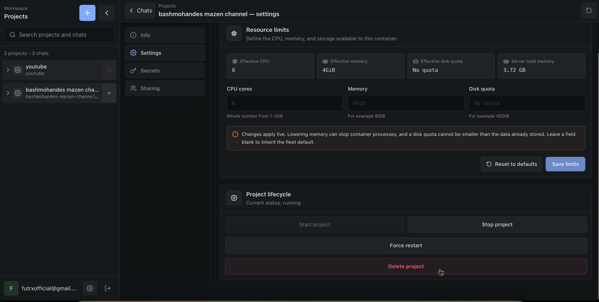

### Creation, provisioning, and lifecycle

Creating a project prompts for a name, derives a project identity/slug, provisions the environment, and reports its running state. Project settings expose:

- effective CPU allocation;
- effective memory allocation;
- disk quota;
- server total memory;
- live limit overrides and reset-to-default behavior;
- start, stop, force restart, and delete actions.

The settings page warns that reducing memory may stop container processes and that disk limits cannot be set below already-used storage. This is a serious infrastructure control surface rather than a cosmetic workspace setting.

### Inspection and observability

The Info page is designed to inspect the container, OS, resources, network, and installed agent tooling. The recording shows provider CLI versions, instruction-file state, authentication-bundle freshness, and host/container synchronization details. This is valuable for diagnosing “agent works on one project but not another” problems.

## 2. Agent authentication and provider abstraction

Global Agent settings provide one-time host authentication for:

- Claude through an Anthropic account;
- Codex through a ChatGPT subscription/device login;
- Kimi through a Kimi subscription/device login.

The UI explicitly says that host credentials are shared with project containers. Codex is shown as using subscription limits rather than API-key billing. Each provider has refresh/re-authentication controls and a configured/not-configured state.

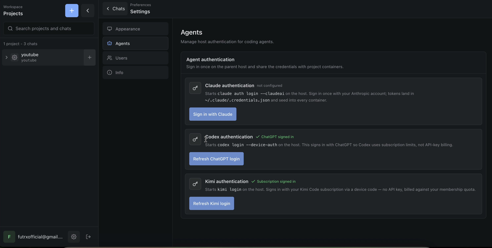

Inside a chat, the provider can be changed without leaving the conversation surface. The recording presents Codex, Claude, and Kimi as interchangeable execution engines over the same project. The user can also configure model, thinking/reasoning, speed, mode, and skill set.

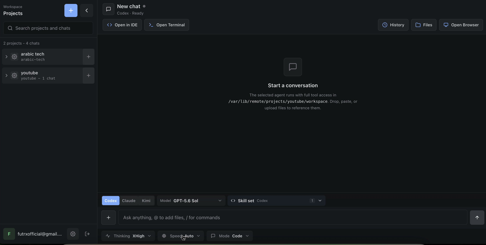

The important product implication is that project state is the durable center; the model is replaceable. This reduces provider lock-in and lets users choose a stronger or cheaper agent per task.

## 3. Chat as an execution control plane

The chat is not merely conversational. It exposes and records operational work:

- user prompts and agent responses;
- streamed working/ready status;
- grouped tool-call summaries;
- project and chat activity indicators;
- agent model and configuration;
- queued follow-up prompts;
- stop/cancel control;
- references to files and commands;
- direct links into the generated application.

Multiple chats can run concurrently across projects. A follow-up can be queued while a run is active, allowing the user to supervise several long-running jobs rather than waiting in one modal interaction.

### Voice and multilingual input

The composer has voice capture with an explicit “Listening…” state. The walkthrough dictates prompts in Arabic, while using English technical terms and later English prompts. The agent responds in Arabic and English. This makes the interface approachable for users who are more comfortable describing work verbally than writing specifications.

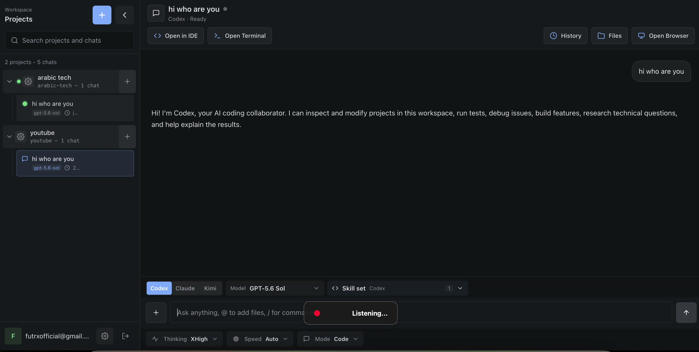

### Skills

The recording shows a selected `browser` skill and later asks the agent to create a project-specific transcription skill. Skills are positioned as reusable operating procedures that teach the agent how to perform specialized work, including browser automation and video processing.

## 4. Full Linux execution environment

The narrator contrasts Remote with a conventional web chat: the agent is inside a complete Linux machine and can inspect the filesystem, install the tools it needs, run servers, create Git repositories, and execute end-to-end workflows.

This capability is the source of most of the product’s power, but it also means the agent has broad authority. The safe operating model depends on project isolation, scoped credentials, careful secrets handling, network policy, and auditable actions.

## 5. Application preview and visual iteration

The first browser system is an application preview. When the agent starts a development server, Remote discovers the port and embeds the running application next to the chat. The recording shows a Node process on port `4173` and a live Arabic video/transcript web page.

The preview supports resizing, refresh/navigation controls, opening externally, and closing. The narrator explains that ports receive automatic URLs on the configured domain and can be shared with authorized users.

### Visual element inspection

The most distinctive preview feature is inspect-to-prompt. The user selects an element in the rendered page; Remote captures element text, HTML, layout/style information, and inserts a structured browser-element block into the composer. The user then asks for a change in plain language.

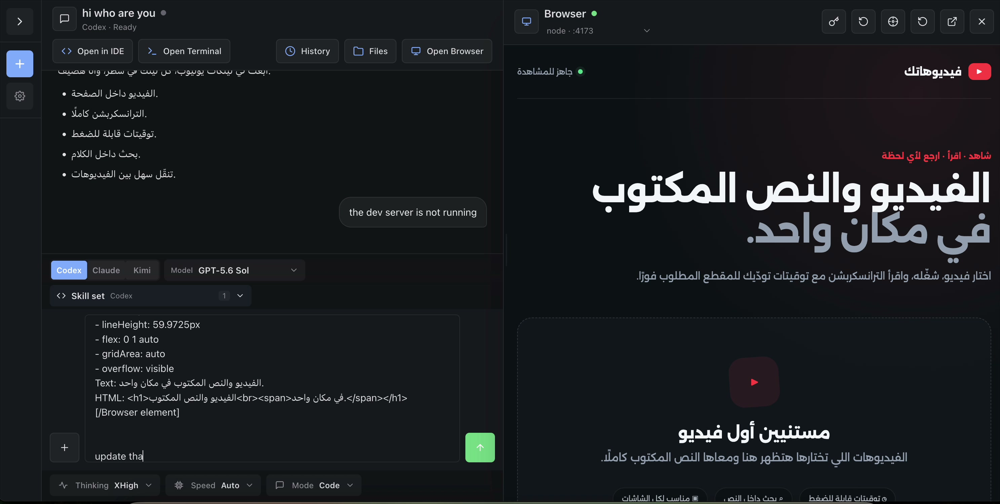

This creates a tight “point, describe, update, refresh” loop. It is materially better than asking a non-technical user to identify a component or CSS selector.

## 6. IDE, terminal, files, and Git

### Browser IDE

`Open in IDE` launches a full code-server/VS Code environment. The recording shows the Explorer, source files, dot-directories for agents/providers, source control, extensions, and live editing. The narrator’s central claim is that a heavy local development laptop is unnecessary because the compute and tooling live on the server.

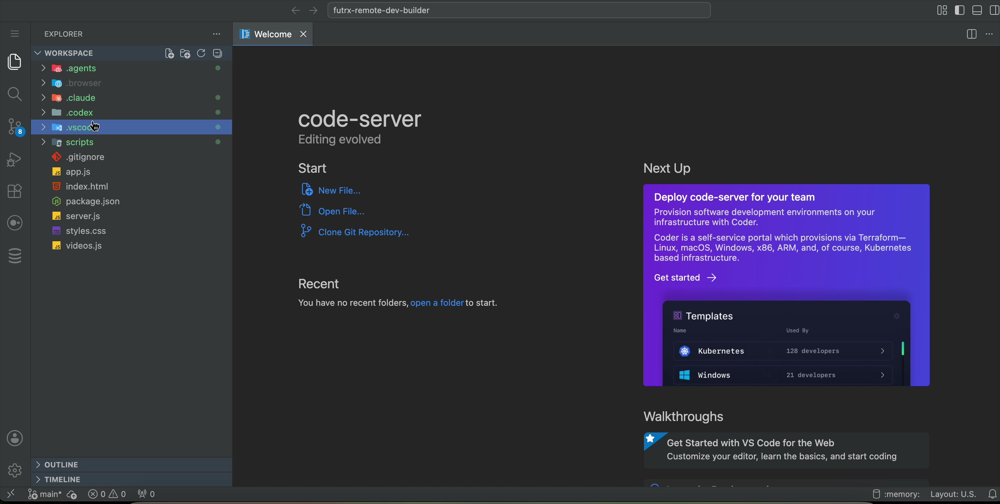

### Terminal

`Open Terminal` provides direct shell access to the same project. The terminal is useful for quick checks, process control, package installation, and troubleshooting without opening the IDE.

### File manager

The Files drawer exposes a searchable workspace tree with folder expansion, file sizes, and download actions. This supports non-programmers who may want the generated artifact without navigating a code editor.

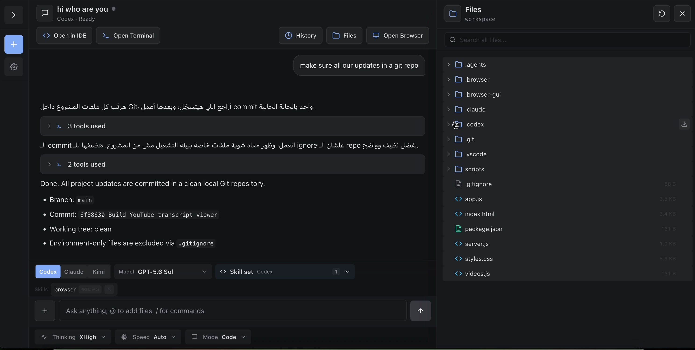

### Git history

The History drawer has a repository selector, commit list, diff view, and a switch action. In the recording it is initially empty because the generated project has not yet been initialized as a repository. The user then instructs the agent to create a clean Git repository and commit all work; the agent reports a branch, commit hash, clean tree, and ignored environment-only files.

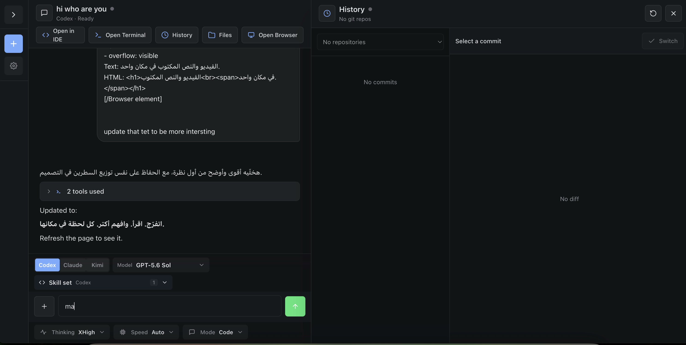

## 7. Two browser systems, not one

Remote has two clearly different browser experiences:

| Browser | Purpose | Who controls it |
| --- | --- | --- |
| Application preview | Display and inspect a web server running in the project | The user’s main browser, with inspect-to-prompt tooling |
| Agent browser | Browse arbitrary external sites from the remote Linux machine | Agent automation and human control share the same headed Chromium session |

### Agent browser

The Agent browser opens a graphical Chromium session inside the remote project. The recording shows the user/agent searching Google, handling a localized consent page, checking public IP/location, and running a Fast.com speed test.

The narrator describes it as similar to “computer use,” but persistent on the server and independent of the user’s local computer. Human intervention is available when a site presents consent, CAPTCHA, login, or anti-bot friction.

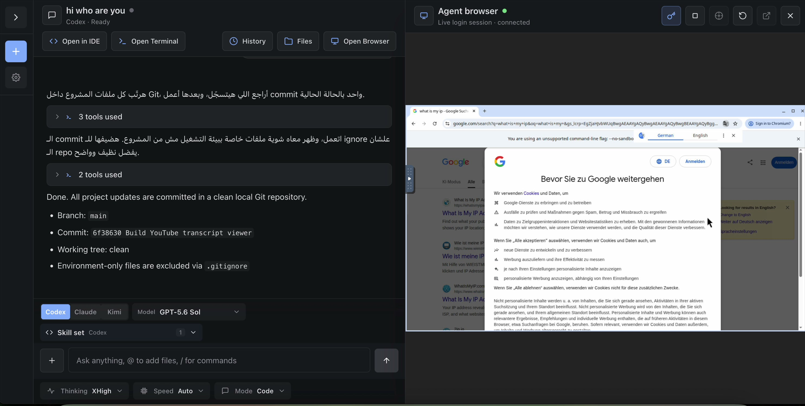

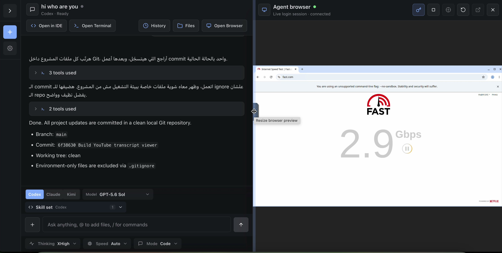

This browser can potentially support research, logged-in operations, social-media analysis, and outbound publishing. Those use cases demand strong credential isolation, action confirmation, and audit logs.

## 8. Access, sharing, and secrets

### Sharing and login wall

The project settings navigation includes Sharing. The narrator explains that a user must be registered/added to the project and sign in with Google before accessing protected project links. The walkthrough does not complete the invitation flow, so access enforcement should be verified separately.

### Project secrets

The Secrets page accepts a key and a multi-line value such as JSON or PEM content. Its on-screen explanation says secrets are passed to the selected agent CLI as `--env KEY=VALUE` for each prompt, never land in the container filesystem, and are not synchronized back from it.

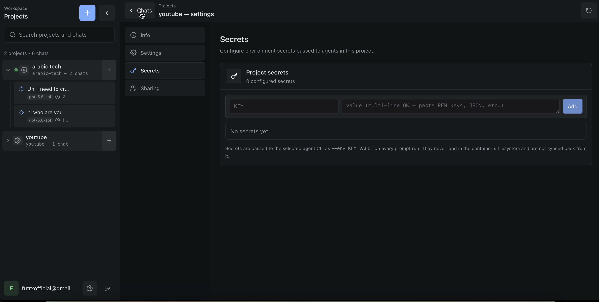

This is the correct direction for credential hygiene, but “hidden from the model” and “not written to disk” are stronger claims than the video proves. They should be verified with runtime tests, log inspection, process-list inspection, crash dumps, and prompt-injection scenarios.

## 9. Mobile, PWA, and background operation

The narrator describes Remote as a Progressive Web App that can be opened on a phone. Because execution happens on the server, tasks can continue while the local browser or computer is closed. This turns the application into a remote job supervisor as much as a coding environment.

The recording does not show the mobile layout, installation prompt, push notifications, offline shell, or background-task recovery, so these are described capabilities rather than fully demonstrated ones.

## 10. Use cases shown or claimed

The walkthrough demonstrates or proposes:

- building and iterating on a marketing website;
- creating a YouTube video/transcript viewer;
- installing video-download/transcription dependencies;
- general web research and external-site browsing;
- social-media analysis with a logged-in browser;
- motion-graphics and video-editing workflows through custom skills;
- uploading finished videos to YouTube using delegated credentials;
- running multiple development servers and independent projects concurrently.

These examples show that the intended product category is broader than “remote IDE.” It is a general-purpose, persistent agent workstation.

## 11. Strengths

1. **Strong mental model.** “One project equals one computer” is easy to understand and maps cleanly to isolation and persistence.
2. **Provider flexibility.** Codex, Claude, and Kimi share the same workspace and UI.
3. **Complete workflow surface.** Chat, browser preview, IDE, terminal, files, Git, and browser automation are one click apart.
4. **Fast visual feedback.** Inspect-to-prompt reduces the gap between seeing a problem and describing the change.
5. **Asynchronous supervision.** Concurrent chats, queued prompts, remote execution, and mobile access support long-running work.
6. **Non-developer accessibility.** Voice input, generated previews, and file downloads let users work without living in code.
7. **Operational visibility.** Container, provider, resource, and authentication information is surfaced in the product.

## 12. Risks, ambiguities, and validation needs

### Claims that should not be treated as proven limits

- “Unlimited” projects, chats, and ports really means no obvious product-level limit was presented. CPU, memory, storage, file descriptors, LXD networking, certificates, and provider quotas still impose limits.
- The local resource comparison in Activity Monitor is illustrative, not a controlled benchmark. It compares different applications and does not include server cost.
- The 2.9 Gbps result demonstrates the tested VPS path at that moment, not guaranteed browser-agent throughput.

### Security considerations

- Full Linux access plus outbound internet access is powerful enough to exfiltrate data if an agent follows a malicious instruction.
- A persistent logged-in browser profile expands the blast radius of prompt injection from websites.
- Project isolation protects neighboring projects only if container configuration, mounts, kernel, device access, and host APIs are hardened.
- Secret injection must avoid logs, command history, `/proc` exposure, tool output, screenshots, and accidental inclusion in prompts.
- Human confirmation should gate irreversible or external actions such as publishing, purchasing, deleting, or posting to social media.
- Preview access is described both as a shareable/public URL and as protected by a login wall. The precise authentication contract should be made explicit in the UI and documentation.

### UX and product gaps visible in the walkthrough

- Project creation uses a browser-native prompt dialog; a first-class creation form could expose name validation, template, region, resource defaults, and estimated cost.
- The initial Git History view says “No git repos” without explaining how to initialize one.
- Agent-browser anti-bot friction needs a clear human-takeover state and recovery path.
- Long-running chat output can become dense; summarization, task milestones, and artifact/result panels would help.
- The boundary between host-level provider credentials, project secrets, and browser-session credentials should be explained in one security center.

## Product verdict

The application’s core value is the combination of durable project isolation, interchangeable coding agents, and complete browser-accessible work surfaces. The recording convincingly demonstrates the end-to-end development loop and the shared agent browser. The remaining work is less about adding another tool and more about making the platform’s security boundary, scaling behavior, cost model, and external-action controls as explicit as its feature set.
