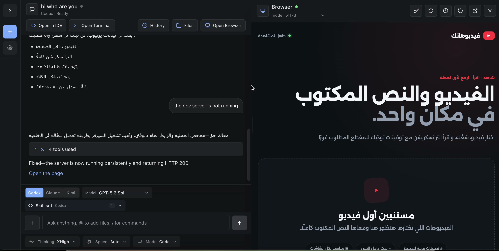
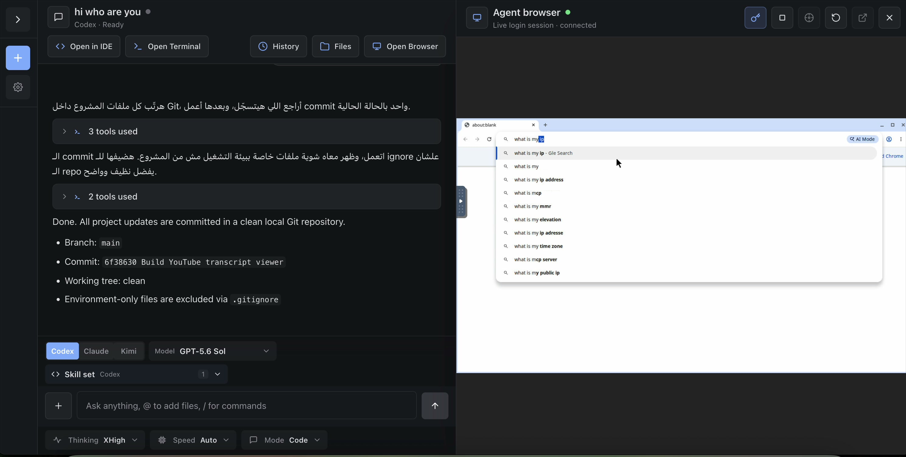

# Remote

## A computer for every project. Any agent you choose.

Remote gives Codex, Claude, and Kimi a persistent Linux computer in the cloud—then gives you one browser-based place to direct the work, inspect the result, and take control when needed.

Create a project and Remote provisions an isolated workspace with durable files, chats, processes, ports, tools, browser state, and project settings. Ask an agent to build, research, automate, or operate. Watch the application take shape beside the conversation. Point at a page element to request a change. Open the same project in the IDE, terminal, file manager, Git history, or shared agent browser without rebuilding context in another tool.

**Remote is not another coding model. It is the place where coding models work.**

> **Positioning line:** Remote is the self-hosted operating environment for AI-powered projects.

> **Campaign line:** Your agents need a computer, not another chat window.

## The problem

AI development is fragmented. The agent lives in one app, the code in another, the terminal somewhere else, the preview on a temporary port, and browser automation in a separate service. Long-running work is often tied to one laptop. Every new tool introduces another login, another context boundary, and another place to lose track of what changed.

Remote turns that collection of tools into one durable project computer.

## The product promise

### One project, one computer

Each Remote project is its own Linux environment. Its files, processes, ports, tools, chats, browser profile, resource limits, and secrets remain attached to the project—not trapped in a single conversation.

### Bring the right agent to the work

Choose Codex, Claude, or Kimi from the same chat surface. Change the model, reasoning level, speed, mode, and skills without moving the project or recreating its environment. The project is durable; the agent is a choice.

### Go from prompt to running product in one view

When an agent starts a web application, Remote discovers the port and opens the result beside the conversation. Select a rendered element and Remote adds its text, markup, styles, and location to the next prompt. The feedback loop becomes simple: **see it, point at it, change it, refresh it.**

### Use the interface that fits the moment

Stay in chat for delegation. Open the browser IDE for hands-on editing. Use the terminal for direct control, the file manager to retrieve artifacts, and Git history to review progress. Every surface operates on the same project.

### Let the agent browse—and step in when judgment is required

Remote includes a headed browser that the agent and user can share. The agent can navigate and operate; the user can intervene for consent, authentication, CAPTCHA, or any decision that should remain human-controlled. The browser runs with the remote project rather than depending on a tab left open on a laptop.

### Work from anywhere

Remote is browser-first and presented as a Progressive Web App. The compute remains on the server, so long-running jobs can continue while the local browser or computer is closed. Project sharing and authenticated links provide a path for controlled collaboration.

## What customers are buying

Customers are not buying “chat with AI.” They are buying:

- **continuity** — work persists beyond a tab, session, or laptop;
- **control** — the user can inspect files, processes, code, commits, and browser activity;
- **choice** — different agents can work against the same durable project;
- **speed** — build, preview, revise, and verify without stitching together separate services;
- **access** — a capable development environment from a lightweight computer or phone;
- **ownership** — the platform and project compute can remain under the operator's control.

## Best-fit customers

### AI-native builders and small product teams

Run several projects and agents in parallel without turning every developer laptop into infrastructure. Move from idea to working application while retaining conventional access to code, Git, files, and the terminal.

### Agencies and studios

Give every client engagement a separate workspace, running previews, durable context, and controlled access. Use voice and visual selection to collect feedback from people who do not speak in file paths or CSS selectors.

### Technical founders and operators

Delegate implementation and web operations while keeping a direct path into the environment. Inspect the work at the level appropriate to the moment: conversation, rendered product, source code, shell, or browser.

### Remote and resource-constrained teams

Move compute and tooling to the server. Use the same browser-accessible environment from a modest laptop, tablet, or phone instead of reproducing a heavy local setup on every device.

## Competitive position

Remote should not be marketed as “a better coding agent.” Claude Code and Codex are highly developed coding-agent products, while OpenClaw and Hermes Agent are broad personal-agent systems. Remote's defensible category is different:

> **Remote is a self-hosted fleet of persistent project computers with interchangeable agents and complete browser-based work surfaces.**

The most useful comparison is therefore not “which model writes the best code?” It is “where does the work live, how can a human supervise it, and how much of the workflow is integrated?”

### Competitive snapshot

| Dimension | Remote | Claude Code | Codex desktop | OpenClaw | Hermes Agent |
| --- | --- | --- | --- | --- | --- |
| Product center | Persistent project computers | Claude-powered agentic coding | Command center for OpenAI agents | Self-hosted personal assistant gateway | Self-improving personal agent |
| Primary experience | Browser/PWA | Terminal, IDE, desktop, web, mobile | Desktop with mobile remote access | Messaging channels, web UI, desktop/mobile nodes | CLI, desktop, web dashboard, messaging |
| Execution model | Isolated server-side Linux environment per project | Local machine, Anthropic cloud, or remote-controlled local session | Local folders, worktrees, SSH devboxes, and OpenAI cloud | Self-hosted gateway with workspaces and optional sandboxes | Local, Docker, SSH, or cloud/serverless terminal backends |
| Model strategy | Codex, Claude, or Kimi in one project UI | Claude-centered; third-party providers on selected surfaces | OpenAI models | Broad provider and model routing | Model-agnostic provider routing and fallback |
| Parallel work | Multiple chats across multiple project computers | Subagents, agent teams, and background sessions | Multiple agents, projects, threads, and worktrees | Multi-agent routing and subagents | Isolated subagents and parallel delegation |
| Development surfaces | Built-in IDE, terminal, files, Git, port routing, live preview | Operates in the terminal/IDE/desktop and integrates with Git | Files, terminals, diffs, worktrees, browser, editor handoff | Workspace, shell/file tools, browser, plugins | Terminal/file tools plus ACP editor integration |
| Visual web iteration | Live project preview plus element-to-prompt context | App preview and Chrome/computer-use integrations | In-app browser with page annotations | Managed browser automation; not centered on app preview | Browser automation with cloud/local/headed modes |
| Human browser takeover | Shared headed remote browser | Available through browser/computer-use surfaces | Shared in-app browser and approval flow | Managed profiles with manual login/control | Headed browser supports watching and intervention |
| Long-running work | Server-side background work; scheduling was not demonstrated | Cloud routines, desktop schedules, and background agents | Automations and long-running agents | Cron jobs, heartbeats, and background events | Cron, event hooks, and background delegation |
| Messaging reach | Web/PWA; broad chat-channel integrations were not demonstrated | Slack plus web/mobile handoff | Desktop plus mobile remote supervision | Major strength: many consumer and team channels | Major strength: 20+ messaging platforms |
| Durable intelligence | Durable project/chat state; personal learning was not demonstrated | Project instructions and automatic memory | Memory and reusable skills | Durable sessions, workspace context, skills | Major strength: curated memory and a skill-learning loop |
| Best fit | Teams that want self-hosted, full-stack AI project workspaces | Developers who want a deeply integrated Claude coding agent | Developers coordinating OpenAI agents across local and remote code | Users who want one personal agent across messaging and devices | Users who prioritize memory, learning, portability, and broad automation |

This is a product-positioning comparison, not a benchmark of model quality. “Not demonstrated” refers to the supplied Remote walkthrough and should not be read as proof that an unpublished capability cannot exist.

## Remote versus Claude Code

[Claude Code](https://code.claude.com/docs/en/overview) is a mature agentic coding system that reads a codebase, edits files, runs commands, works with Git, and extends through skills, hooks, MCP, subagents, and agent teams. Its current surfaces include terminal, IDE, desktop, web, mobile handoff, cloud execution, and Remote Control. Its strongest story is the depth and consistency of the Claude coding experience across those surfaces. ([Official platform comparison](https://code.claude.com/docs/en/platforms))

Remote's advantage is not a larger list of agent features. It is the **project environment around the agent**: a self-hosted Linux computer, built-in browser IDE, file manager, project resource controls, automatic port routing, a live inspectable preview, and a shared remote browser. Remote also makes Codex, Claude, and Kimi peers in the same workspace.

**Choose Remote when:** the environment must be persistent, browser-accessible, self-hosted, visually inspectable, and usable by more than one model provider.

**Choose Claude Code when:** the priority is a Claude-first coding agent with mature terminal workflows, deep extensibility, cloud routines, and broad first-party surface coverage.

**Positioning shorthand:** Claude Code is the developer agent. Remote is the computer and control plane the agent works inside.

## Remote versus Codex desktop

[Codex desktop](https://openai.com/index/introducing-the-codex-app/) is a polished command center for parallel OpenAI agents. It offers project threads, isolated Git worktrees, reviewable diffs, skills, automations, terminals, remote devboxes, computer use, and an in-app browser with annotations. OpenAI has also added mobile supervision and remote access to machines running Codex. ([Current product update](https://openai.com/index/codex-for-almost-everything/), [remote and mobile workflow](https://openai.com/index/work-with-codex-from-anywhere/))

The overlap with Remote is real: both products coordinate concurrent agent work, expose development tooling, and support visual browser feedback. The distinction is architectural. Codex desktop is an OpenAI agent experience attached to local folders, worktrees, remote machines, and OpenAI cloud execution. Remote is a browser-first, self-hosted environment that provisions and operates a separate Linux computer per project and lets several agent providers use it.

**Choose Remote when:** teams need provider choice, server-owned project environments, direct browser access, project resource/lifecycle controls, and one URL-based workspace for chat, IDE, terminal, preview, files, Git, and browser.

**Choose Codex desktop when:** teams are committed to OpenAI's agent stack and value first-party Codex models, worktree-native parallelism, desktop computer use, ecosystem integrations, and a highly integrated local/SSH workflow.

**Positioning shorthand:** Codex desktop orchestrates OpenAI agents. Remote operates the computers on which multiple kinds of agents can work.

## Remote versus OpenClaw

[OpenClaw](https://docs.openclaw.ai/concepts/features) is a self-hosted personal-agent gateway built to follow the user across messaging channels, devices, sessions, and background events. It supports multi-agent routing, broad model-provider choice, workspaces, optional sandboxing, managed browsers, media, plugins, cron jobs, and an unusually wide catalog of chat channels. ([Model providers](https://docs.openclaw.ai/concepts/model-providers), [agent workspace](https://docs.openclaw.ai/agent-workspace))

Remote and OpenClaw share self-hosting, model flexibility, agent browsing, and persistent work. Their centers of gravity differ. OpenClaw organizes around **one personal agent available everywhere**. Remote organizes around **many isolated project computers**, each with a complete visual development environment.

**Choose Remote when:** the primary job is building, running, reviewing, and sharing project artifacts or web applications in isolated environments.

**Choose OpenClaw when:** the primary job is a persistent assistant reachable through WhatsApp, Telegram, Slack, iMessage, and other channels, with automations that span a person's digital life.

**Positioning shorthand:** OpenClaw is your agent across every conversation. Remote is your project across every development surface.

## Remote versus Hermes Agent

[Hermes Agent](https://hermes-agent.nousresearch.com/docs/) is a model-agnostic, self-improving agent with persistent memory, autonomous skill creation, provider routing, terminal backends, browser automation, voice, scheduled tasks, plugins, subagents, an API server, IDE integration, and a large messaging gateway. Its standout claim is a closed learning loop that turns experience into reusable memory and skills. ([Official feature overview](https://hermes-agent.nousresearch.com/docs/user-guide/features/overview/))

Hermes is strongest where the **agent itself** must become more personalized, capable, and portable over time. Remote is strongest where the **project environment** must be visible, isolated, persistent, and operable through a browser by both agents and humans.

**Choose Remote when:** a team wants project-scoped compute, browser-native development surfaces, live application previews, inspect-to-prompt iteration, access controls, and operational visibility across a fleet of workspaces.

**Choose Hermes Agent when:** the priority is long-term memory, self-improving skills, voice and messaging reach, flexible execution backends, and an agent that follows the user across environments.

**Positioning shorthand:** Hermes improves the agent. Remote operationalizes the project.

## Why Remote can win

### 1. The project—not the conversation—is the durable unit

Chats end. Models change. Projects remain. Remote attaches the code, runtime, browser, ports, settings, files, and history to an environment that survives beyond any one agent session.

### 2. Provider choice is visible and practical

Remote does not merely expose a model API setting. It presents Codex, Claude, and Kimi as selectable workers over the same project and reuses configured provider authentication across project containers.

### 3. Human supervision is built into the work surface

The user can move smoothly between delegation and direct action: review a live page, select an element, edit code, run a command, inspect a file, view Git history, or take over the browser.

### 4. It collapses an entire remote-development stack

For the demonstrated workflow, Remote combines project/container management, multi-agent chat, a browser IDE, terminal, files, Git, application preview, URL routing, visual inspection, browser automation, and project secrets.

### 5. It makes remote compute approachable

“One project equals one computer” is a clear mental model. Users do not need to begin with containers, SSH, port forwarding, or infrastructure vocabulary to get the benefit of them.

## What not to claim yet

Credible marketing will outperform inflated marketing. Until independently tested and documented, avoid absolute claims such as:

- “unlimited projects, chats, or ports”;
- “secrets can never be exposed”;
- “fully secure” or “perfectly isolated”;
- guaranteed server speed or lower total cost than local tools;
- complete mobile parity;
- scheduled automation, durable personal memory, or automatic skill learning.

Prefer defensible language: **project-scoped**, **isolated by design**, **self-hosted**, **browser-accessible**, **persistent**, **provider-flexible**, and **built for human supervision**.

## Recommended homepage copy

### Hero

**A computer for every project. Any agent you choose.**

Run Codex, Claude, or Kimi inside persistent, isolated Linux workspaces. Build, preview, inspect, browse, edit, and ship from one browser-based control plane.

**Primary CTA:** Create a project  
**Secondary CTA:** Watch the walkthrough

### Supporting section

**Stop rebuilding context across tools.**

Remote keeps the agent, code, runtime, preview, terminal, files, Git history, and browser together. Start with a prompt. Step into the environment whenever you want. Leave the compute running when you step away.

### Three proof points

1. **Choose your agent** — Use Codex, Claude, or Kimi without moving the project.
2. **See the work** — Open the running app beside the chat and point directly at what should change.
3. **Own the environment** — Keep durable project computers and their resources under your control.

### Closing CTA

**Give your next idea a computer.**

Create a Remote project and move from conversation to working software without leaving the browser.

## Sales-ready elevator pitch

Remote is a self-hosted operating environment for AI projects. Every project gets a persistent Linux computer with its own files, processes, ports, browser, chats, and controls. Teams can use Codex, Claude, or Kimi to do the work, then supervise it through a live application preview, visual element inspection, browser IDE, terminal, file manager, Git history, and a shared headed browser. Instead of tying an agent to one laptop or one model vendor, Remote makes the project itself durable, accessible, and ready for whichever agent is best for the task.

---

## Evidence and source note

Remote capabilities in this document are based on the supplied 18:23 product walkthrough and its frame-verified [feature analysis](feature-analysis.md). Demonstrated, described, and inferred claims are distinguished in that analysis. Competitor information was checked against official product documentation on **July 22, 2026**. These products change quickly, so the competitive table should be revalidated before external publication.
