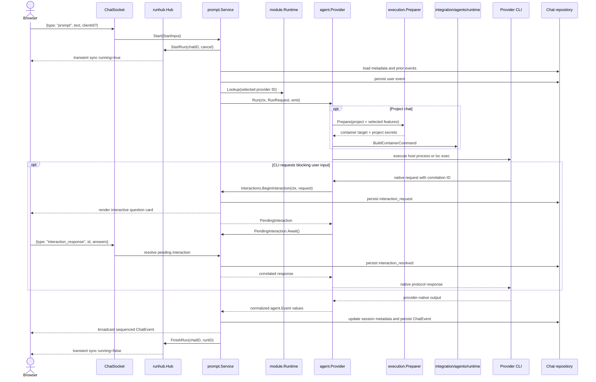

# Runtime and event parsing

This chapter follows one prompt from the chat WebSocket to a provider CLI and
back into Remote's persisted event stream. Provider packages own CLI syntax and
wire-protocol parsing. The service layer sees only the contracts in
[`internal/agent`](../../../backend/internal/agent/model.go).

## End-to-end run path



The concrete entry points are:

1. [`ChatSocket.handle`](../../../backend/internal/transport/ws/chat_socket.go)
   validates the chat and caller, subscribes to replay plus live events, and
   accepts `prompt`, `cancel`, and correlated `interaction_response` messages.
2. [`prompt.Service.Start`](../../../backend/internal/service/prompt/service.go)
   acquires the process-local, one-run-per-chat lock in
   [`runhub.Hub`](../../../backend/internal/service/runhub/hub.go). A racing
   start returns `ErrPromptAlreadyRunning`. An accepted interactive `clientId`
   is persisted in hidden chat delivery metadata so reconnect retries remain
   idempotent even after a visible-history rewind; the accepted/rejected ack
   event itself remains connection-local and transient.
3. [`prompt.Service.runPromptAs`](../../../backend/internal/service/prompt/service.go)
   resolves chat state, prepares a provider-neutral request, looks up the
   registered runtime, and calls `Provider.Run`.
4. The provider launches and parses its own CLI. It emits
   [`agent.Event`](../../../backend/internal/agent/model.go) values without
   importing chat, transport, store, or frontend types.
5. [`emitAgentEvent`](../../../backend/internal/service/prompt/agent_events.go)
   persists session identity, projects recognized agent events into chat
   events, and sends them through the run hub. The hub appends them to the
   store before broadcasting them.

The run lock, subscriptions, and cancellation state are backend-memory state.
They disappear on restart, and Remote does not reattach to a provider process
that survives the backend.

## How `RunRequest` is built

[`agent.RunRequest`](../../../backend/internal/agent/model.go) is the only run
input a provider receives.

| Field | Source and meaning |
| --- | --- |
| `Provider` | Normalized chat provider ID. Chat creation/update and the prompt boundary both enforce module membership and host/project scope. |
| `ConversationID` | Remote chat ID, used to correlate events and logs. It is not the provider-native session ID. |
| `Prompt` | Current prompt after optional visible-history recovery and provider-specific skill triggers are added. |
| `Cwd` | Live tmux working directory when available, otherwise stored chat cwd, then host home as a fallback. |
| `Model` | Saved model ID. The adapter must validate or safely pass it as one process/protocol argument. |
| `Mode` | Currently only `default` can execute. An older saved `plan` value is rejected without mutation so a read-only expectation can never silently become a mutable run. The user must explicitly choose a supported mode before resending. |
| `ResumeID` | Session ID stored for the selected provider, but only when the descriptor declares resume support. |
| `Fork` | `ForkPending`, but only when the descriptor declares native fork support. |
| `ProjectID` | Empty for a loose host chat; otherwise identifies the workspace container. |
| `Preferences` | Saved reasoning effort and service tier. Adapters decide which supported values to forward. |
| `EnableBrowser` | True only when the selected `browser` skill and the module's `BrowserTools` declaration both permit it. |
| `EnableScheduleTools` | True only for a project run when scheduled tools are declared and selected or the turn itself is scheduled. |
| `RuntimeEnv` | Short-lived backend-issued schedule API URL and grant. Invalid environment names are discarded and these values override same-named project secrets. |
| `Interact` | Callback for a provider-native request. It persists a correlated request, waits for a browser response, Remote auto-resolution, or cancellation, then returns the answer to the same active run. |

If no native session is available, the prompt service prepends visible `user`
and `assistant_text` history. The transcript is bounded to the last 24,000
bytes. Tool output and reasoning are not copied into that transcript. See
[`visibleTranscript`](../../../backend/internal/service/prompt/service.go) and
[`promptWithVisibleHistory`](../../../backend/internal/service/prompt/service.go).

Selected skills are translated from the module's declared strategy by
[`promptWithSelectedSkills`](../../../backend/internal/service/prompt/service.go):

- `slash-command` prefixes slash-style `/skill-name` triggers;
- `dollar-mention` adds `$skill-name` instructions;
- `instructions` points at the selected `SKILL.md` files;
- `none` leaves the prompt unchanged.

## Host and project execution

Every built-in provider has a provider-local command builder. A factory and
profile declare policy, but they do **not** automatically implement the
provider's native run command. A new adapter must translate `RunRequest`; for
project execution it receives the shared
[`agent.ProjectPreparer`](../../../backend/internal/agent/project.go) port
constructed by `module.Factory` through
[`service/agent/execution`](../../../backend/internal/service/agent/execution).

For a loose chat, built-ins execute the provider binary directly on the host
with the requested working directory and a filtered/augmented environment.

For a project chat, `execution.Preparer` owns this common workflow:

1. Resolve the project through [`agent.ProjectResolver`](../../../backend/internal/agent/project.go)
   and reject a missing container name.
2. Call `ProjectResolver.Start` even when stored state says `running`. This
   reconciles a container deleted or replaced outside the process.
3. Validate that [`provisioning.ContainerDependencies`](../../../backend/internal/agent/provisioning/container_dependencies.go)
   is either completely wired or completely zero. Production supplies the
   complete set.
4. Use the exact validated provider profile to ensure the CLI and, where
   supported, credentials. Publish shared instructions and skill compatibility
   links; apply the provider factory's browser policy; provision scheduled
   tooling when requested; enable LXD boot autostart.
5. Load project secrets. Failure is currently best-effort and yields an empty
   secret list.

Before reconciliation the preparer emits `system/container_starting` only when
the stored project status is not running; it still calls `Start` on every
preparation. It emits `system/container_preparing` only when a nonzero set of
container ports enters the provisioning phase.

The preparer returns only the stable project/container target and secrets. The
adapter then calls
[`runtime.BuildContainerCommand`](../../../backend/internal/integration/agents/runtime/container_command.go)
to assemble `lxc exec`, normally from `/workspace`. Provider-owned fixed
environment entries come first, then project secrets, provider-forced entries,
and finally sorted backend runtime variables. Runtime keys mask same-named
secrets even when the runtime key is later discarded as invalid. The adapter
still owns its binary, arguments, stdin or positional prompt, and execution
protocol.

After a successful run, Claude, Codex, and Kimi make a best-effort credential
sync from the container. Its application-wide timeout currently defaults to
30 seconds through `config.AgentOptions`; Antigravity has no credential sync
contract.

Factories express only real policy differences:

| Provider | Credentials | Skill-link failure | Browser assets | Browser MCP/core |
| --- | --- | --- | --- | --- |
| Claude | Seed from its profile | Best effort | Best effort | Required when Browser is enabled |
| Codex | Reject host API-key auth, then seed | Fatal | Best effort | Required when Browser is enabled |
| Kimi | Seed/synchronize its dynamic directory | Best effort | Best effort | Not used |
| Antigravity | None | Best effort | Not used | Not used |

Failures to list project secrets are currently ignored and the run continues
without them. Backend-issued runtime variables win over project secrets with
the same key. Codex additionally removes `OPENAI_API_KEY` and rejects a host
auth record explicitly marked as API-key authentication. It does not currently
pre-inspect a newer project-local auth record before launch. Its intended flow
is ChatGPT subscription authentication; see
[Authentication and access](04-authentication-and-access.md#current-provider-behavior)
for the current readiness-check limitation.

The provider-specific implementations are in:

- [`claude/command.go`](../../../backend/internal/integration/agents/claude/command.go)
- [`codex/command.go`](../../../backend/internal/integration/agents/codex/command.go)
- [`kimi/command.go`](../../../backend/internal/integration/agents/kimi/command.go)
- [`antigravity/command.go`](../../../backend/internal/integration/agents/antigravity/command.go)

The shared orchestration and command construction are in:

- [`service/agent/execution/preparer.go`](../../../backend/internal/service/agent/execution/preparer.go)
- [`integration/agents/runtime/container_command.go`](../../../backend/internal/integration/agents/runtime/container_command.go)

## Runtime and parser contracts

[`agent.Provider`](../../../backend/internal/agent/model.go) deliberately has
only three responsibilities:

```go
type Provider interface {
    ID() ProviderID
    Capabilities(context.Context, CapabilityRequest) (Capabilities, error)
    Run(context.Context, RunRequest, func(Event)) error
}
```

`Parser(req)` is **not** part of `agent.Provider`. Structured-stream adapters
may implement [`agent.LineParser`](../../../backend/internal/agent/parser.go)
and use [`runtime.RunProcess`](../../../backend/internal/integration/agents/runtime/process.go),
but a provider may own a different protocol loop.

`RunProcess` scans non-empty stdout lines, logs and skips individual parse
errors, emits every parsed event, and stops accepting additional stderr lines
for its `ProcessError` capture after the buffer reaches 64 KiB. Its default
stdout line limit is 16 MiB and stderr line limit is 1 MiB. Cancellation is
treated as a normal stop and returns `nil`. If the parser emitted `run.failed`
and the process then exits non-zero, it returns `agent.ErrRunFailed`;
otherwise a non-zero exit is returned as a process error.

An adapter must ensure that a successful native run produces a normalized
`run.completed` event. The shared line runner does not synthesize one merely
because a process exits zero. An adapter that already emitted `run.failed`
should return an error wrapping `agent.ErrRunFailed`; this prevents the prompt
service from appending a second generic `<provider> exit` error.

## Normalized agent events

The provider boundary uses [`agent.Event`](../../../backend/internal/agent/model.go).
The prompt projection currently recognizes the following types:

| Agent event | Persisted chat event | Required fields or behavior |
| --- | --- | --- |
| `session.updated` | `session` | Set `SessionID`; provider defaults to the selected provider when omitted. The ID is also saved in chat metadata. |
| `system` | `system` | Use `Subtype` and optional JSON `Data`; `Message` is not projected for system events. |
| `assistant.delta` | `assistant_text` | Put only newly produced text in `Text`. |
| `reasoning.delta` | `thinking` | Put only newly produced reasoning text in `Text`. |
| `tool.started` | `tool_use_start` | Set stable `ItemID`, `ToolName`, and JSON `Input`. |
| `tool.completed` | `tool_use_end` | Reuse `ItemID`; set `Output` and `IsError`. |
| `run.completed` | `complete` | Put normalized token data in `Usage` when the provider supplies it. |
| `run.failed` or `error` | `error` | Put safe user-facing text in `Message`. |

`run.started` and `usage.updated` exist in the agent enum but are not projected
by [`chatEventFromAgentEvent`](../../../backend/internal/service/prompt/agent_events.go),
so current adapters must not rely on them for user-visible state. Raw native
payloads may be kept in `agent.Event.Raw` for diagnostics, but that field is
not copied into the persisted chat event.

## Native harness interactions

Provider requests that require a correlated browser response do not masquerade
as ordinary agent events.
`RunRequest.Interactions.BeginInteraction` accepts an
`agent.InteractionRequest` containing a stable ID, kind, tool name, JSON input,
blocking/sensitive flags, and an optional Remote-owned auto-resolution delay.
The prompt service registers that ID under the chat, persists
`interaction_request`, and then returns an `agent.PendingInteraction`. This
synchronous first phase lets the provider resume reading native protocol output
without allowing a later delta to overtake the question card. The provider's
request worker calls `PendingInteraction.Await` for the correlated response.
Multiple IDs may be pending in one turn. The browser may answer only while the
socket is open, synchronized, and the chat is still streaming:

```json
{"type":"interaction_response","id":"item-123","answers":{"environment":["QA"]}}
```

The service resolves the in-memory waiter, persists `interaction_resolved`,
and returns the structured answer to the provider adapter. The pending session
retains the exact context supplied during registration, so native resolution or
run cancellation interrupts that same waiter. Cancellation emits an error
resolution. Blocking requests never arm a timeout. For Codex
`isBlocking:false`, Remote ignores the protocol's deprecated
`autoResolutionMs` field and returns an empty outer answer map after a fixed
120-second window. The browser hides the first 60 seconds and shows the final
60 seconds as a countdown. The first selection, keypress, or paste sends the
transient activity signal below and permanently snoozes that auto-resolution,
matching the pinned Codex TUI's engaged-user behavior:

```json
{"type":"interaction_activity","id":"item-123"}
```

Timeout, activity, cancellation, and response race under one broker lock, so
only one terminal outcome wins. Persisting the request/resolution makes the
card and its final state replayable, but the pending channel is process-local;
a backend restart cannot resume it. Duplicate or late responses are rejected.
Sensitive answers are returned to the active provider request: neither the
Remote resolved event nor browser storage contains their value. Codex receives
the plaintext answer and may persist it in provider-owned rollout/session
state; `isSecret` is not an end-to-end non-persistence guarantee.

The frontend marks these cards interactive and uses question IDs as answer
keys. A normal `tool.started` event named `AskUserQuestion` has no live waiter;
that legacy print-tool path intentionally submits its readable text as a later
prompt instead.

## Provider parsing behavior

### Claude

[`claude.Provider.Run`](../../../backend/internal/integration/agents/claude/provider.go)
launches `claude -p --output-format stream-json --include-partial-messages
--verbose` and uses [`claude.Parser`](../../../backend/internal/integration/agents/claude/parser.go)
through `runtime.RunProcess`.
It always uses Default with the normal approval bypass. A stale Plan value is
rejected without mutation before launch because Remote does not yet implement Claude
Code's `--permission-prompt-tool` MCP bridge and the corresponding blocking
`AskUserQuestion`/`ExitPlanMode` lifecycle for its print adapter.

The parser maps:

- a changed `session_id` to `session.updated`;
- `stream_event` text deltas to `assistant.delta`;
- assistant `thinking` and `tool_use` blocks to reasoning/tool-start events;
- user `tool_result` blocks to tool completion;
- `system` records to normalized system events;
- `result` to `run.completed`, or to `run.failed` when `is_error` is true.

Malformed top-level JSON is returned to `RunProcess`, logged, and skipped.
Malformed nested messages are ignored after any session event already derived
from that line.

### Codex: production app-server path

Production Codex runs do **not** use
[`codex/parser.go`](../../../backend/internal/integration/agents/codex/parser.go).
[`codex.Provider.Run`](../../../backend/internal/integration/agents/codex/provider.go) starts
one fresh `codex app-server` process per turn and delegates to
[`runAppServer`](../../../backend/internal/integration/agents/codex/app_server_run.go).
The process is ephemeral, while a persisted thread can still be resumed or
forked.

The JSON-RPC sequence is:

1. send `initialize` with Remote client information and experimental API
   support;
2. after its response, send `initialized` and `thread/start`, `thread/resume`,
   or `thread/fork`;
3. require a non-empty returned thread ID and model, emit `session.updated`
   for a new/different thread, then send `turn/start`;
4. capture the turn ID from the `turn/start` response, then consume
   notifications for that thread and turn until its `turn/completed` emits
   `run.completed` or `run.failed`; close stdin after that terminal notification.

The app-server connection can also stream subagent activity. Remote filters
message, tool, reasoning, usage, and completion notifications by the returned
main thread and turn IDs before parsing or publishing them. Child completion
must not close the connection, cancel pending requests, or replace the main
answer or usage. Notifications for the main thread that arrive before the
`turn/start` response are buffered until its turn ID is known. Subagents still
communicate with their parent inside Codex; server-to-client requests and their
`serverRequest/resolved` notifications remain correlated across the connection,
including requests from subagents.

[`appServerEventParser`](../../../backend/internal/integration/agents/codex/app_server_events.go)
maps agent/plan deltas, reasoning deltas, command execution, file changes, MCP
and dynamic tools, collaboration tools, web search, last-turn token usage, and
terminal turn state. It tracks text already emitted for each item so completed
whole-text snapshots contribute only the missing suffix.

[`appServerRequestHandler`](../../../backend/internal/integration/agents/codex/app_server_requests.go)
also answers server-to-client requests:

- user-input requests require unique non-empty question IDs and run on
  asynchronous workers so later native deltas keep streaming. The scanner
  waits only until the request card is registered, preserving protocol order.
  Each thread start/resume/fork opts into the pinned CLI's disabled-by-default
  `features.default_mode_request_user_input` feature so Default may issue these
  requests.
  `isBlocking:true` waits without a timeout; `isBlocking:false` uses Remote's
  fixed 120-second empty-answer policy and can be snoozed by browser activity.
  `options:null` is a freeform question, and additional notes are encoded with
  Codex's native `user_note: ` prefix. Secret answers are excluded from Remote
  events and browser storage but may persist in Codex-owned session state;
- `serverRequest/resolved`, terminal notification, or run cancellation cancels
  the matching pending worker without writing a late JSON-RPC response;
- mutation approvals are accepted under the current approval-free Default
  policy. Plan is not executable or advertised yet;
- MCP elicitation is cancelled;
- unknown requests receive JSON-RPC `-32601`.

A failed `thread/resume` or `thread/fork` whose message contains `not found` or
`no rollout` becomes `agent.ErrSessionNotFound`. Other protocol errors are
wrapped in `runtime.ProcessError` with captured stderr.

[`codex/parser.go`](../../../backend/internal/integration/agents/codex/parser.go) parses the
older `codex exec --json` JSONL shape and remains covered by focused tests, but
it is currently a compatibility parser rather than the production run path.
Do not use it as the reference when changing app-server event handling.

### Kimi

[`kimi.Provider.Run`](../../../backend/internal/integration/agents/kimi/provider.go) runs
`kimi -p <prompt> --output-format stream-json` through `RunProcess` and parses
it with [`kimi.Parser`](../../../backend/internal/integration/agents/kimi/parser.go).
The adapter rejects stale Plan before launch and ignores saved reasoning-effort
preferences: the pinned CLI rejects `--plan` with `-p`, and this print command
has no forwarded effort argument. Neither control is advertised.

Kimi's OpenAI-chat-shaped JSONL maps assistant content and tool calls, tool
results, and the final `role=meta,type=session.resume_hint` record. That final
record supplies a changed session ID and is also Kimi's de-facto
`run.completed`; the CLI does not provide a separate completion, reasoning, or
usage line. Because Kimi has no native fork primitive, `Run` clears `ResumeID`
when `Fork` is true.

### Antigravity

Antigravity print mode is unstructured. Production
[`antigravity.Provider.Run`](../../../backend/internal/integration/agents/antigravity/provider.go)
therefore bypasses `RunProcess` and streams raw stdout chunks as assistant
deltas so blank lines and Markdown paragraphs survive. It captures a 4 KiB
combined output tail for errors, maps sign-in-looking failures to a focused
instruction, and emits completion itself.

Because print mode does not report a new conversation ID, the adapter snapshots
the provider's `brain` directory before and after a fresh run. Exactly one new,
valid directory becomes `session.updated`; zero or multiple candidates are
treated as ambiguous and no session is saved. See
[`antigravity/session.go`](../../../backend/internal/integration/agents/antigravity/session.go).
Its [`parser.go`](../../../backend/internal/integration/agents/antigravity/parser.go) is a
line-oriented test/helper parser, not the production chunk-streaming path.
Antigravity and Kimi both clear resume state for requested forks because their
descriptors do not declare native fork support.
The Antigravity adapter also rejects stale Plan before launch and uses its
normal approval bypass because print mode cannot relay a native
control/approval round trip.

## Sessions, forks, and recovery

Sessions are stored in the provider-keyed `Meta.Sessions` map. The four named
session fields remain only as compatibility mirrors for older records and
clients. A new provider needs no new storage field. See
[`chat.Meta.NormalizeSessions`](../../../backend/internal/service/chat/model.go)
and [`filechat` records](../../../backend/internal/stores/filechat/records.go).

The module descriptor controls orchestration:

- without `Resume`, the prompt service never passes the saved ID;
- `Fork` is invalid unless `Resume` is also true;
- chat forking preserves and marks a provider session only when native fork is
  declared; otherwise the copied chat starts fresh from visible history;
- a `session.updated` event clears `ForkPending` and may populate an empty chat
  model from the provider's reported model.

Any adapter may return `agent.ErrSessionNotFound`. When it does so during a
resume, the prompt service clears only that provider's saved session, clears
the pending fork, persists a `system/session_recovered` event, rebuilds a
bounded visible transcript, and retries the turn once without `ResumeID`.

## Failure and cancellation rules

- The WebSocket `cancel` path calls the run's context cancellation. Providers
  must launch children with that context; the in-memory run lock is released
  when the run goroutine returns.
- A cancellation is not persisted as an error by the shared process runner.
- Parser errors for individual structured lines are logged and skipped so one
  malformed provider message does not discard the rest of the turn.
- If a provider returns an error other than `agent.ErrRunFailed`, the prompt
  service persists `<provider> exit: <error>`.
- A provider-emitted `run.failed`/`error` is already persisted through the
  normal event projection. Return `agent.ErrRunFailed` to avoid duplicating it.
- `run.completed` and provider error events are persisted. Run-hub `sync`
  state and prompt accepted/rejected acknowledgements are transient.

## Tests to add for a run adapter

In the concrete provider package, pin the behavior the adapter owns:

- exact Default translation and fail-closed rejection of stale unsupported
  Plan requests without changing their semantics;
- correlated blocking interaction requests, responses, cancellation, timeout,
  duplicate IDs, and missing-handler behavior when the harness supports them;
- model, effort, service-tier, resume, fork, browser, and schedule behavior the
  descriptor claims;
- provider preparation-policy declarations;
- provider-native host/project arguments and environment entries;
- session discovery and `ErrSessionNotFound` mapping;
- text/reasoning deltas, tool start/end correlation, completion with usage, and
  failure parsing;
- malformed/unknown native records and cancellation;
- compile-time `var _ agent.Provider = (*Provider)(nil)` in `factory.go`.

Keep shared workflow tests in their owning packages: project reconciliation,
provisioning order, error text, and best-effort branches belong under
`internal/service/agent/execution`; common container command and environment
precedence belong under `internal/integration/agents/runtime`; factory projection and
validation belong under `internal/service/agent/module`.

Run focused tests first, then from `backend/` run:

```bash
go test ./internal/integration/agents/<id> ./internal/integration/agents/runtime ./internal/service/agent/execution ./internal/service/agent/module ./internal/service/prompt
go test -race ./internal/integration/agents/<id> ./internal/integration/agents/runtime ./internal/service/agent/execution ./internal/service/prompt
go test ./...
go vet ./...
```
