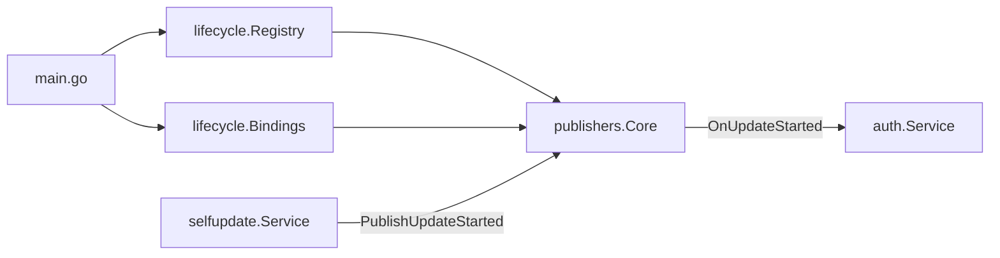
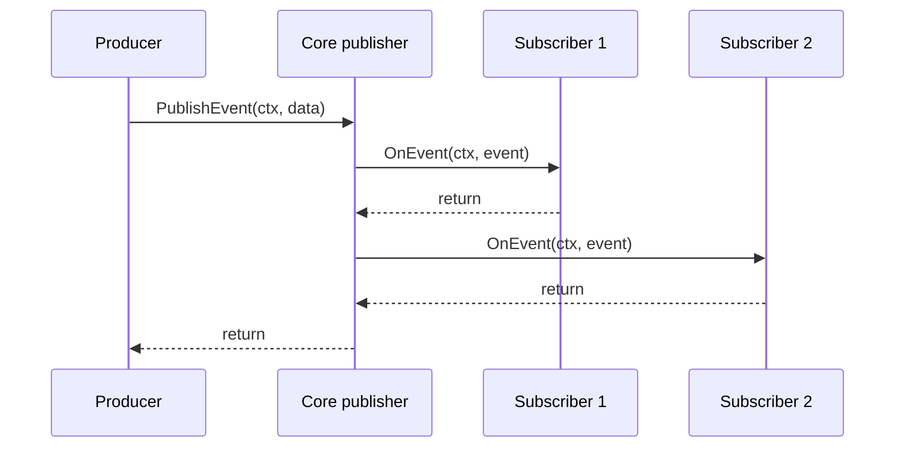
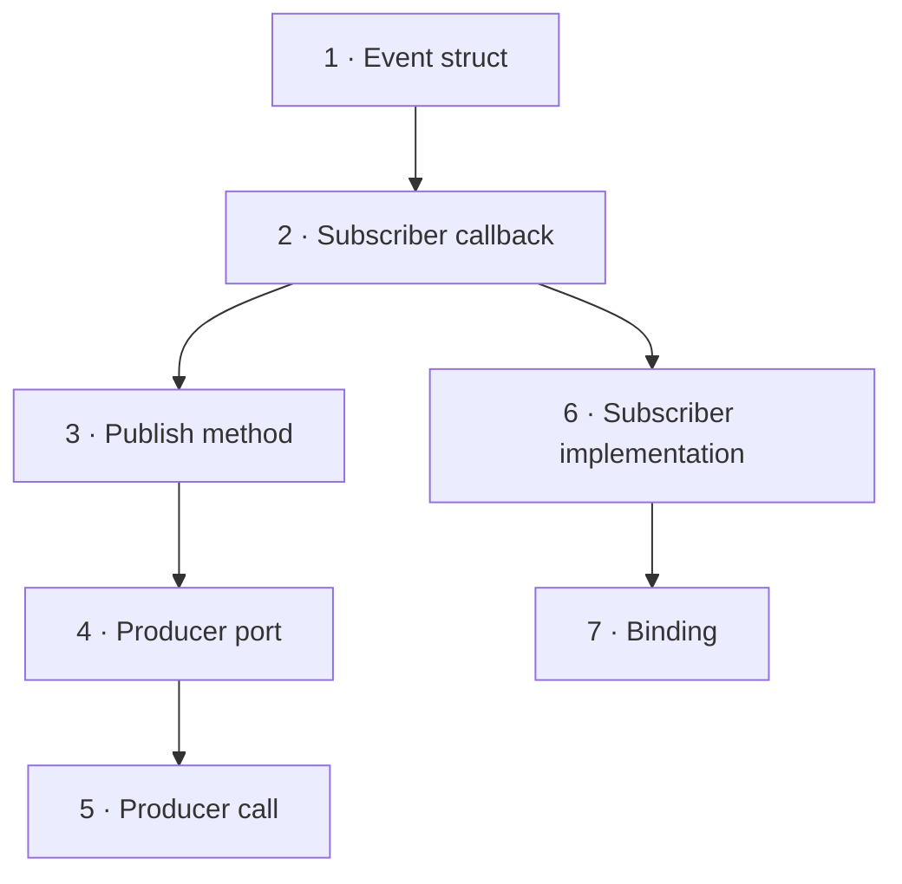
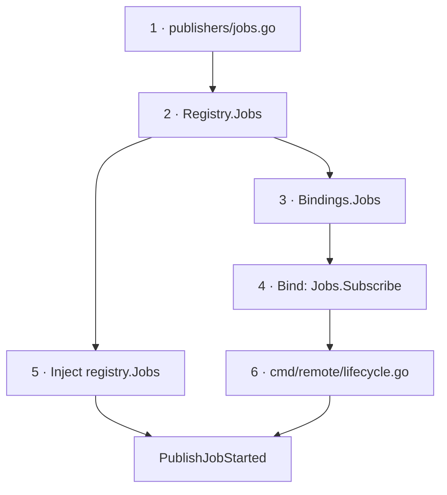

# Lifecycle events

## Runtime





## New event · existing publisher



### `backend/internal/lifecycle/publishers/core.go`

```go
type UpdateCancelledEvent struct {
    Target    string
    Kind      string
    StartedBy string
}

type CoreSubscriber interface {
    OnUpdateStarted(context.Context, UpdateStartedEvent)
    OnUpdateSucceeded(context.Context, UpdateSucceededEvent)
    OnUpdateFailed(context.Context, UpdateFailedEvent)
    OnUpdateCancelled(context.Context, UpdateCancelledEvent)
}

func (c *Core) PublishUpdateCancelled(ctx context.Context, target, kind, startedBy string) {
    event := UpdateCancelledEvent{Target: target, Kind: kind, StartedBy: startedBy}
    for _, subscription := range c.snapshot() {
        subscription.subscriber.OnUpdateCancelled(ctx, event)
    }
}
```

### `backend/internal/service/<producer>/ports.go`

```go
type UpdateLifecyclePublisher interface {
    PublishUpdateCancelled(context.Context, string, string, string)
}
```

### `backend/internal/service/<producer>/service.go`

```go
s.lifecycle.PublishUpdateCancelled(ctx, target, kind, startedBy)
```

### `backend/internal/service/<subscriber>/update_lifecycle.go`

```go
var _ publishers.CoreSubscriber = (*Service)(nil)

func (s *Service) OnUpdateCancelled(
    ctx context.Context,
    event publishers.UpdateCancelledEvent,
) {
    // subscriber-owned reaction
}
```

### `backend/cmd/remote/lifecycle.go`

```go
Core: []publishers.CoreSubscriber{
    services.Auth,
    services.Audit,
},
```

## New publisher



### `backend/internal/lifecycle/publishers/jobs.go`

```go
type JobStartedEvent struct {
    ID string
}

type JobsSubscriber interface {
    OnJobStarted(context.Context, JobStartedEvent)
}

type Jobs struct {
    // Subscribe + snapshot ownership: core.go
}

func NewJobs() *Jobs
func (j *Jobs) Subscribe(JobsSubscriber) func()
func (j *Jobs) PublishJobStarted(context.Context, string)
```

### `backend/internal/lifecycle/registry.go`

```go
type Registry struct {
    Core *publishers.Core
    Jobs *publishers.Jobs
}

func NewRegistry() *Registry {
    return &Registry{
        Core: publishers.NewCore(),
        Jobs: publishers.NewJobs(),
    }
}
```

### `backend/internal/lifecycle/bindings.go`

```go
type Bindings struct {
    Core []publishers.CoreSubscriber
    Jobs []publishers.JobsSubscriber
}

for _, subscriber := range bindings.Jobs {
    unsubscribes = append(unsubscribes, registry.Jobs.Subscribe(subscriber))
}
```

### `backend/cmd/remote/lifecycle.go`

```go
return lifecycle.Bind(registry, lifecycle.Bindings{
    Core: []publishers.CoreSubscriber{
        services.Auth,
    },
    Jobs: []publishers.JobsSubscriber{
        services.Audit,
    },
})
```

## Verification

```bash
go test -race ./internal/lifecycle/... ./internal/service/<producer> ./internal/service/<subscriber>
go test ./...
go vet ./...
```
