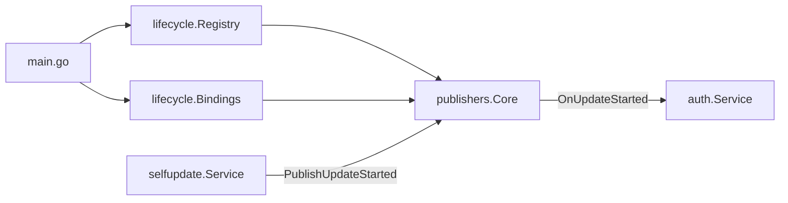
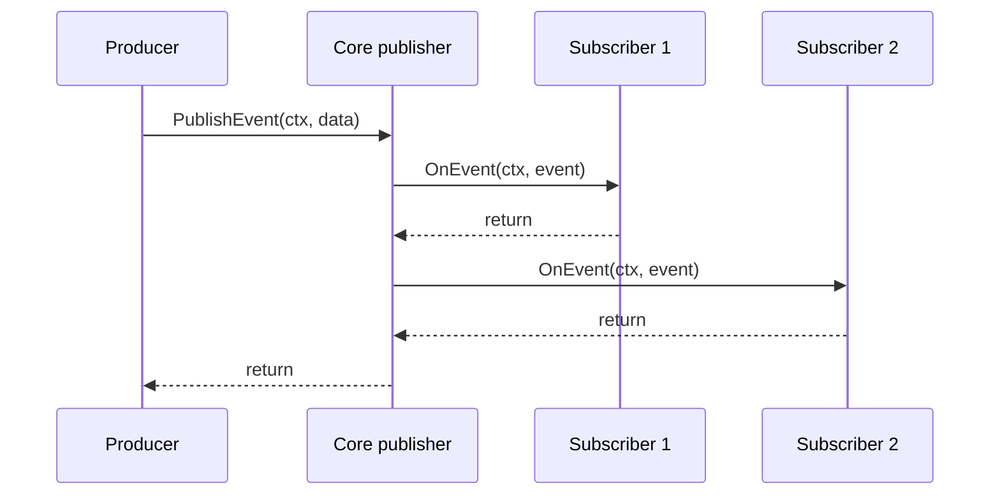
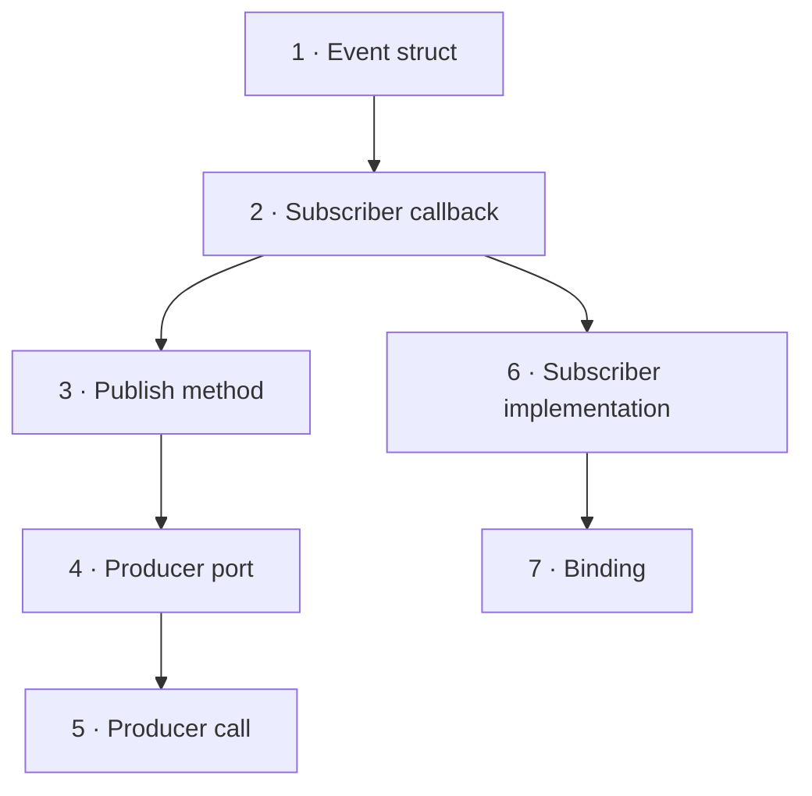
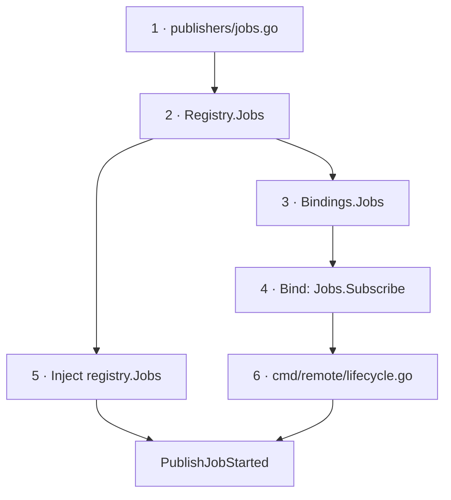
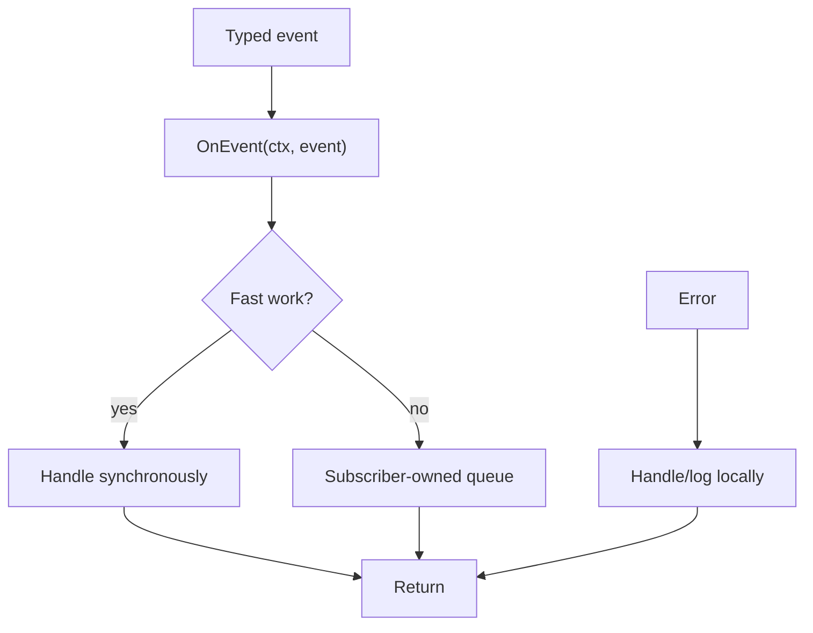

# Lifecycle events

The lifecycle package provides typed, in-process publisher/subscriber communication.

- `Registry` constructs and exposes every publisher.
- Each publisher owns its events, subscribers, and dispatch behavior.
- `Bindings` connects fully constructed services to publishers.
- `cmd/remote/lifecycle.go` declares the application-specific connections.
- Producers depend only on the publishing methods they use.

## Runtime



1. `main` constructs the publisher registry.
2. `main` injects `registry.Core` into the self-update producer.
3. `main` constructs the application services.
4. `bindLifecycle` registers those services as typed subscribers.
5. The producer publishes an event at the owning workflow transition.
6. The publisher creates the event and calls every subscriber in registration order.
7. The process invokes the aggregate unbind function during shutdown.



## New event · existing publisher



1. Add the event struct to its owning publisher.
2. Add the callback to the publisher's subscriber interface.
3. Add a publish method that creates and dispatches the event.
4. Add only that publish method to the producer-owned port.
5. Publish at the service operation that authoritatively owns the transition.
6. Implement the callback on every subscriber; use an explicit no-op when no reaction is required.
7. Add new subscriber services to the existing publisher binding.

### `backend/internal/lifecycle/publishers/core.go`

```go
type UpdateCancelledEvent struct {
    Target    string
    Kind      string
    StartedBy string
}

type CoreSubscriber interface {
    OnUpdateStarted(context.Context, UpdateStartedEvent)
    OnUpdateSucceeded(context.Context, UpdateSucceededEvent)
    OnUpdateFailed(context.Context, UpdateFailedEvent)
    OnUpdateCancelled(context.Context, UpdateCancelledEvent)
}

func (c *Core) PublishUpdateCancelled(ctx context.Context, target, kind, startedBy string) {
    event := UpdateCancelledEvent{Target: target, Kind: kind, StartedBy: startedBy}
    for _, subscription := range c.snapshot() {
        subscription.subscriber.OnUpdateCancelled(ctx, event)
    }
}
```

### `backend/internal/service/<producer>/ports.go`

```go
type UpdateLifecyclePublisher interface {
    PublishUpdateCancelled(context.Context, string, string, string)
}
```

### `backend/internal/service/<producer>/service.go`

```go
s.lifecycle.PublishUpdateCancelled(ctx, target, kind, startedBy)
```

### `backend/internal/service/<subscriber>/update_lifecycle.go`

```go
var _ publishers.CoreSubscriber = (*Service)(nil)

func (s *Service) OnUpdateCancelled(
    ctx context.Context,
    event publishers.UpdateCancelledEvent,
) {
    // subscriber-owned reaction
}
```

### `backend/cmd/remote/lifecycle.go`

```go
Core: []publishers.CoreSubscriber{
    services.Auth,
    services.Audit,
},
```

## New publisher



1. Create the publisher around one cohesive lifecycle domain.
2. Define its event types and subscriber interface.
3. Keep subscriber storage, snapshots, dispatch, and unsubscribe behavior inside the publisher.
4. Construct and expose the publisher through `Registry`.
5. Add its subscriber slice and registration loop to `Bindings` and `Bind`.
6. Inject the concrete publisher into producers through narrow producer-owned ports.
7. Implement the subscriber interface on each consumer.
8. Register application subscribers in `cmd/remote/lifecycle.go`.

### `backend/internal/lifecycle/publishers/jobs.go`

```go
type JobStartedEvent struct {
    ID string
}

type JobsSubscriber interface {
    OnJobStarted(context.Context, JobStartedEvent)
}

type Jobs struct {
    // Subscribe + snapshot ownership: core.go
}

func NewJobs() *Jobs
func (j *Jobs) Subscribe(JobsSubscriber) func()
func (j *Jobs) PublishJobStarted(context.Context, string)
```

### `backend/internal/lifecycle/registry.go`

```go
type Registry struct {
    Core *publishers.Core
    Jobs *publishers.Jobs
}

func NewRegistry() *Registry {
    return &Registry{
        Core: publishers.NewCore(),
        Jobs: publishers.NewJobs(),
    }
}
```

### `backend/internal/lifecycle/bindings.go`

```go
type Bindings struct {
    Core []publishers.CoreSubscriber
    Jobs []publishers.JobsSubscriber
}

for _, subscriber := range bindings.Jobs {
    unsubscribes = append(unsubscribes, registry.Jobs.Subscribe(subscriber))
}
```

### `backend/cmd/remote/lifecycle.go`

```go
return lifecycle.Bind(registry, lifecycle.Bindings{
    Core: []publishers.CoreSubscriber{
        services.Auth,
    },
    Jobs: []publishers.JobsSubscriber{
        services.Audit,
    },
})
```

## Subscriber behavior

1. Implement the complete typed subscriber interface.
2. Treat the received event as immutable input.
3. Return promptly: dispatch is synchronous.
4. Expect callbacks in subscriber registration order.
5. Use the supplied context for subscriber work.
6. Handle subscriber failures locally: callbacks cannot return errors.
7. Avoid panics: a panic propagates through the publisher to the producer.
8. Own any required queue or background work inside the subscriber.



## Verification

```bash
go test -race ./internal/lifecycle/... ./internal/service/<producer> ./internal/service/<subscriber>
go test ./...
go vet ./...
```
