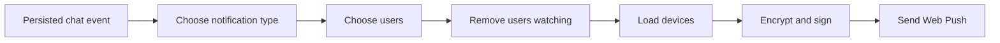

# Event-to-delivery pipeline

Remote creates notifications from persisted chat events, not directly from a
single interactive request. This covers interactive runs, scheduled runs, and
recovery paths.

## Event classification

| Persisted event | Result |
| --- | --- |
| Legacy `tool_use_start` for `AskUserQuestion` | Urgent question notification |
| Correlated `interaction_request` for `AskUserQuestion` | Urgent question notification |
| `interaction_resolved` | No notification; clear waiting-question state |
| Interactive `complete` | Turn-finished notification |
| Interactive `error` | Run-failed notification |
| Scheduled `complete` or `error` | Scheduled-task notification |
| Other event | No notification |

The notifier parks the chat when either question event is persisted. The two
question lifecycles then diverge:

- a legacy print-tool question normally ends its run. Remote suppresses that
  immediately following terminal event so it does not replace the urgent
  question notification in the tray; that terminal event clears the marker,
  and a new `user` event also clears any legacy marker still present;
- a correlated interactive question keeps the run active. Its persisted
  `interaction_resolved` clears the marker before the provider continues, so a
  later real completion/error notification is delivered normally.

This waiting marker is backend memory. Persisted interaction events still
replay in the chat, but a backend restart does not reconstruct push suppression
or the live provider waiter.

## Audience

- A project chat notifies project members and administrators.
- A loose chat notifies every registered user.
- Stale project access entries are discarded unless the email still belongs to
  a registered user.
- Duplicate email addresses are removed.
- A user currently viewing the chat is removed before device lookup.

## Delivery

Remote serializes the notification once, then sends it to every stored device
for each remaining user. `webpush-go` performs payload encryption and VAPID
request construction. Remote supplies the safe HTTP client and interprets the
response.

| Result | Action |
| --- | --- |
| `2xx` | Record the successful send time |
| `404` or `410` | Delete the retired subscription |
| Other error | Log the failure and retain the subscription |

Question notifications use high urgency and a one-hour TTL. Other
notifications use normal urgency and a 12-hour TTL.

## Forked chats

Forking still copies the full visible event history into the new chat. Those
append operations are marked as historical replay, so persistence and
workspace updates run while notification side effects are suppressed.

## Current delivery gaps

- Devices are processed sequentially under one 30-second deadline.
- There is no bounded queue or retry for `429` and temporary `5xx` responses.
